# 软件使用说明书

项目名称：智投社区：股票基金投资论坛系统

本文档对应指导书模块五“软件使用说明书 `user_guid.md`”的提交要求，面向课程演示人员、普通用户、专业用户和管理员，说明系统全部主要功能的使用方法。功能截图位于仓库 `figs/e2e-20260617` 目录。

## 一、访问系统

本地部署后，在浏览器访问：

```text
http://127.0.0.1:5173
```

云端演示地址：

```text
http://8.148.72.200/
```

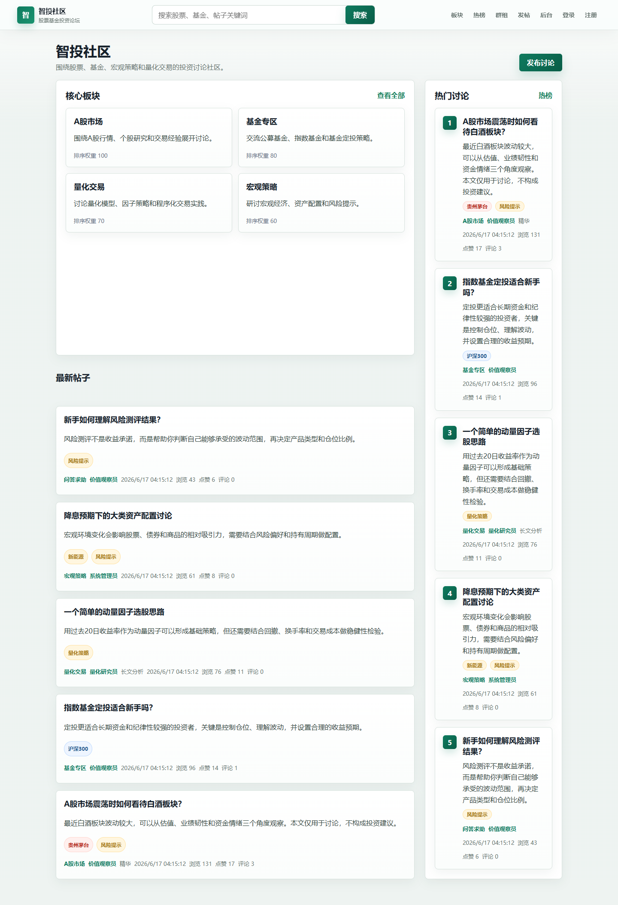

首页提供智投社区的主要入口，包括板块、热榜、群组、关注、发帖、登录、注册、搜索和帖子列表。游客可以直接浏览公开内容；登录用户可以进一步进行发帖、互动、收藏、关注和群组操作。

## 二、账号角色

演示账号密码均为：

```text
Admin123456
```

| 角色 | 邮箱 | 可使用功能 |
| --- | --- | --- |
| 管理员 | `admin@stockforum.com` | 普通用户功能 + 后台管理、审核、举报处理、敏感词、统计 |
| 普通用户 | `value@stockforum.com` | 登录、个人中心、发帖、评论、点赞、收藏、关注、群组、通知、私信 |
| 专业用户 | `quant@stockforum.com` | 普通用户功能 + 专业认证、长文分析演示 |
| 游客 | 无需登录 | 首页、板块、帖子详情、搜索结果、热榜、公开群组浏览 |

## 三、注册、登录与退出

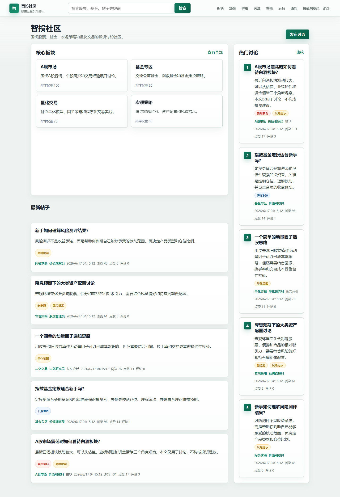

### 1. 登录

1. 点击顶部导航栏“登录”。
2. 输入演示邮箱和密码。
3. 点击登录按钮。
4. 登录成功后，导航栏显示“通知”“个人中心”“退出”等入口。

### 2. 注册

1. 点击顶部导航栏“注册”。
2. 选择手机号或邮箱注册方式。
3. 输入账号、昵称、验证码和密码。
4. 提交后完成注册。

课程演示环境中的验证码为模拟流程，不接入真实短信或邮件服务。

### 3. 退出登录

登录后点击顶部导航栏“退出”，系统会清除本地登录状态并返回游客浏览状态。

## 四、首页浏览功能

首页包含以下功能：

| 功能 | 使用方法 |
| --- | --- |
| 板块入口 | 点击首页板块卡片或顶部“板块”，进入各市场讨论区 |
| 最新帖子 | 在首页查看近期发布内容，点击标题进入详情 |
| 热门讨论 | 查看浏览量、点赞量、评论量较高的帖子 |
| 搜索 | 在顶部搜索框输入股票、基金或关键词，点击搜索 |
| 发帖入口 | 登录后点击“发帖”，进入内容发布页 |
| 群组入口 | 点击“群组”，查看投资主题交流圈 |

## 五、板块与帖子浏览

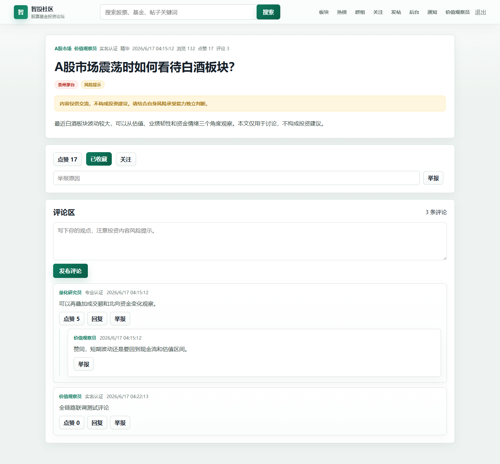

### 1. 查看板块

1. 点击顶部导航栏“板块”。
2. 查看 A 股、港股、美股、基金、量化投资、价值投资等讨论区。
3. 点击某个板块进入板块详情页。
4. 在板块详情页查看该板块下的帖子列表。

### 2. 查看帖子详情

1. 在首页、板块页、搜索结果页或热榜页点击帖子。
2. 进入帖子详情页。
3. 查看标题、正文、作者、发布时间、认证等级、标签、浏览量、点赞数和评论数。
4. 页面中的“内容仅供交流，不构成投资建议”提示用于提醒投资风险。

### 3. 查看标签

帖子详情页和帖子卡片会展示股票、基金、市场或主题标签。标签用于辅助内容分类和检索。

## 六、搜索与热榜功能

### 1. 搜索

1. 在顶部搜索框输入关键词，例如股票名称、基金名称或帖子关键词。
2. 点击“搜索”。
3. 系统跳转到搜索结果页，展示相关帖子。
4. 点击结果进入帖子详情。

### 2. 热榜

1. 点击顶部导航栏“热榜”。
2. 查看系统按热度整理的热门内容。
3. 点击热门帖子进入详情页继续浏览和互动。

## 七、发布内容

登录后点击顶部导航栏“发帖”，进入发布页面。

| 内容类型 | 说明 |
| --- | --- |
| 普通帖子 | 发布常规讨论、问题或投资观点 |
| 长文分析 | 面向专业用户，发布更完整的投资分析内容 |
| 投票帖 | 设置多个投票选项，供用户参与选择 |
| 短动态 | 发布较短的市场观点或即时讨论 |

发布步骤：

1. 选择所属板块。
2. 填写帖子标题。
3. 选择内容类型。
4. 填写正文内容。
5. 勾选股票、基金或主题标签。
6. 如果选择投票帖，填写投票选项。
7. 点击“提交发布”。
8. 发布成功后系统跳转到帖子详情页。

长文分析通常用于专业投资观点展示。普通用户发布长文分析时，系统会进行权限限制。

## 八、帖子互动功能

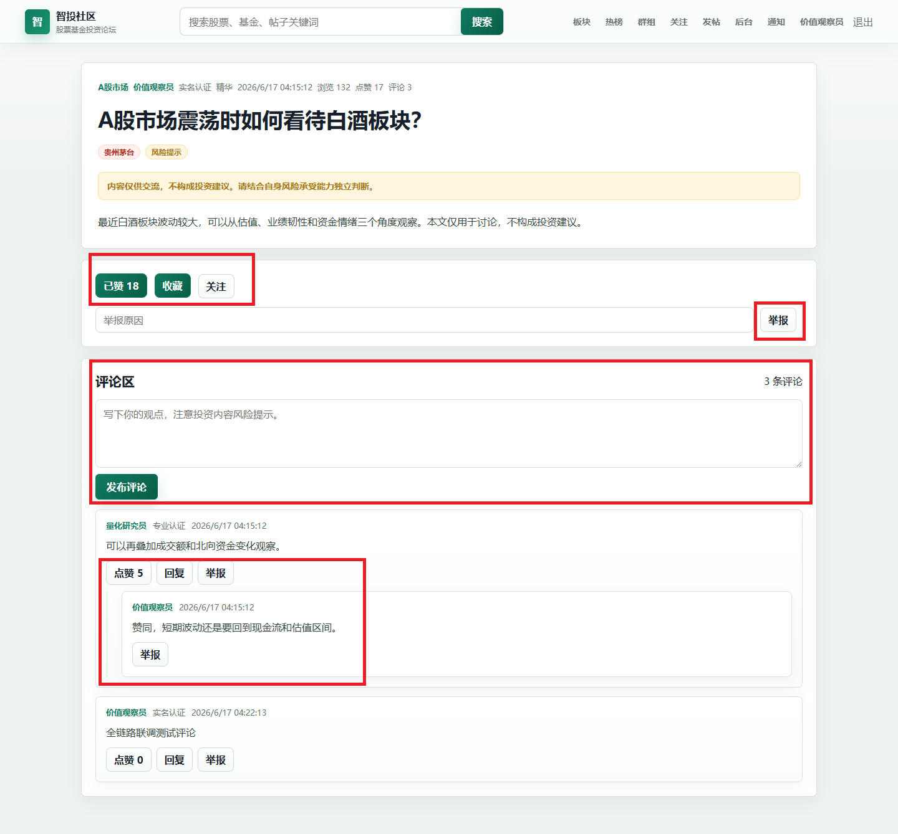

帖子详情页支持以下互动：

| 功能 | 使用方法 |
| --- | --- |
| 点赞 | 点击“点赞”按钮，表达认可；再次点击可取消 |
| 收藏 | 点击“收藏”按钮，帖子会进入“我的收藏” |
| 关注作者 | 点击“关注”按钮，后续可在关注动态中查看作者内容 |
| 举报帖子 | 输入举报原因并点击“举报”，提交给后台处理 |
| 投票 | 在投票帖中点击投票选项，系统记录选择并更新票数 |
| 附件查看 | 如果帖子包含附件链接，可点击链接查看外部资源 |

互动功能需要登录后使用。未登录用户点击相关操作时，应先登录。

## 九、评论与回复

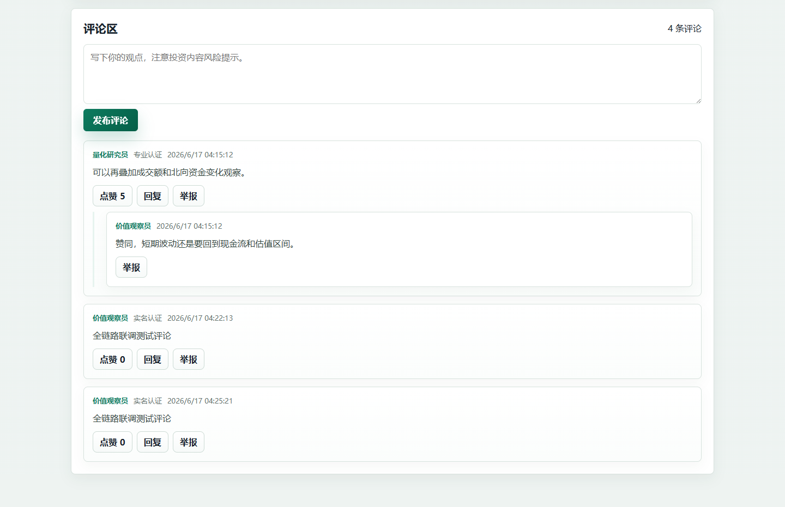

### 1. 发表评论

1. 登录后进入帖子详情页。
2. 在评论输入框填写评论内容。
3. 点击提交。
4. 评论区显示新评论，帖子评论数同步变化。

### 2. 回复评论

1. 在评论列表中找到要回复的评论。
2. 点击回复入口。
3. 输入回复内容并提交。
4. 回复显示在对应评论下方。

### 3. 举报评论

评论区域支持对不当评论进行举报。提交后，后台管理员可在举报管理中处理。

## 十、个人中心

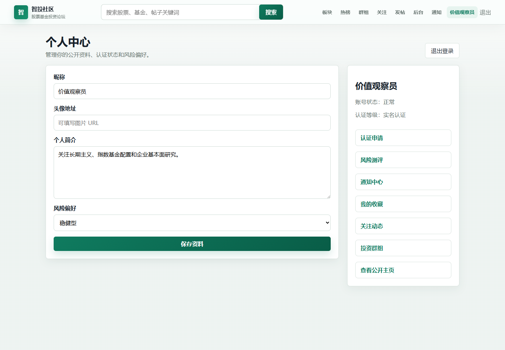

登录后点击顶部导航栏中的昵称或“个人中心”，进入个人中心。

个人中心包含以下功能：

| 功能 | 使用方法 |
| --- | --- |
| 查看资料 | 查看昵称、简介、认证等级、风险偏好、积分、等级和徽章 |
| 编辑资料 | 修改昵称、头像、简介、投资经验、关注市场和隐私设置 |
| 实名认证 | 填写真实姓名和证件信息，提交认证 |
| 专业认证 | 提交专业资质，用于演示专业用户身份 |
| 风险测评 | 回答风险偏好问卷，系统生成风险偏好结果 |
| 我的收藏 | 查看收藏过的帖子 |
| 通知中心 | 查看评论、回复、关注、提及、审核等通知 |
| 私信 | 查看和发送站内私信 |

个人资料保存后，公开主页、帖子作者信息和互动页面会显示更新后的昵称与资料。

## 十一、认证与风险测评

### 1. 实名认证

1. 进入个人中心。
2. 点击实名认证入口。
3. 填写姓名、证件号等信息。
4. 提交认证申请。

### 2. 专业认证

1. 进入个人中心的专业认证入口。
2. 填写资质类型、资质编号或相关说明。
3. 提交认证申请。
4. 专业认证用户可用于演示长文分析发布。

### 3. 风险测评

1. 进入风险测评页面。
2. 根据问卷选择风险承受能力、投资经验和目标偏好。
3. 提交后系统生成风险偏好。
4. 风险偏好会在个人资料中展示。

## 十二、收藏与关注

### 1. 我的收藏

1. 在帖子详情页点击“收藏”。
2. 进入个人中心或“我的收藏”页面。
3. 查看已收藏帖子。
4. 再次点击收藏按钮可取消收藏。

### 2. 关注用户

1. 在帖子详情页点击“关注作者”。
2. 或进入用户公开主页点击关注。
3. 点击顶部导航栏“关注”，进入关注动态。
4. 查看已关注用户发布的内容。

## 十三、通知与私信

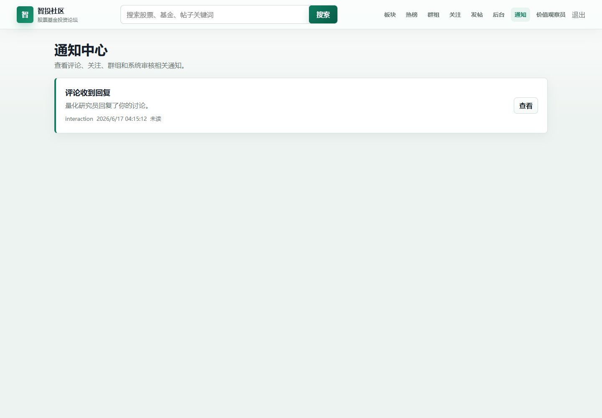

### 1. 通知中心

1. 登录后点击顶部导航栏“通知”。
2. 查看评论、回复、关注、提及、审核等站内通知。
3. 点击标记已读入口后，通知状态变为已读。

### 2. 私信

1. 进入个人中心或用户主页。
2. 选择私信入口。
3. 输入消息内容并发送。
4. 在私信页面查看消息记录。

## 十四、群组功能

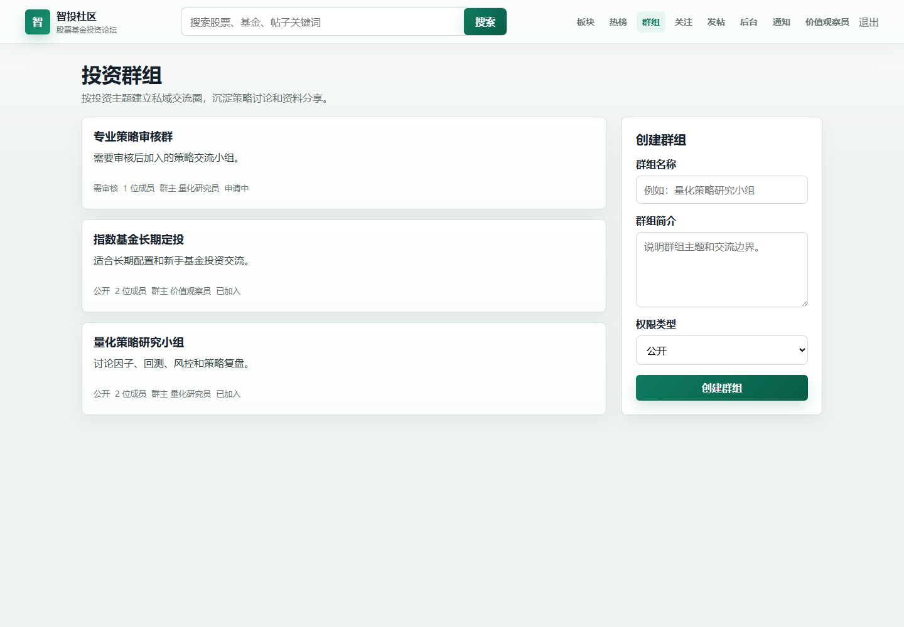

群组是用户围绕特定投资主题建立的交流圈。

### 1. 查看群组

1. 点击顶部导航栏“群组”。
2. 查看公开群组、审核群组和私密群组的可见信息。
3. 点击群组卡片进入群组详情。

### 2. 加入群组

| 群组类型 | 使用方法 | 系统表现 |
| --- | --- | --- |
| 公开群组 | 点击“加入群组” | 直接成为成员 |
| 审核群组 | 点击“申请加入” | 显示申请中，等待管理员或群主处理 |
| 私密群组 | 根据系统可见范围展示 | 通常不允许普通用户直接加入 |

### 3. 群内讨论

加入群组后，可以查看群内讨论并发布群内动态。

### 4. 群组资源

加入群组后，可以添加或查看群组资源，例如研报链接、行情资料、投资学习材料等。

## 十五、管理员后台

管理员登录后，顶部导航栏会显示“后台”。普通用户没有后台权限。


普通用户直接访问后台地址时，系统会进行权限拦截，防止越权操作。

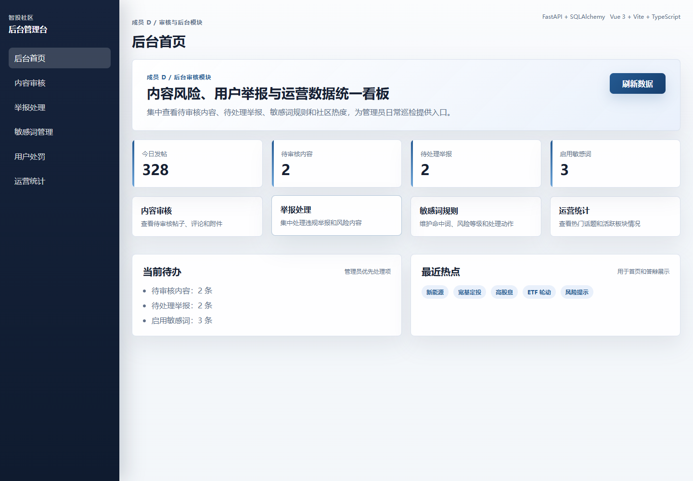

### 1. 后台概览

管理员进入后台后，可查看用户数量、帖子数量、举报数量、待审核内容等系统概况。

### 2. 内容审核

管理员可以查看待审核内容，对帖子、评论、认证申请或群组申请执行通过、驳回等操作。

### 3. 举报处理

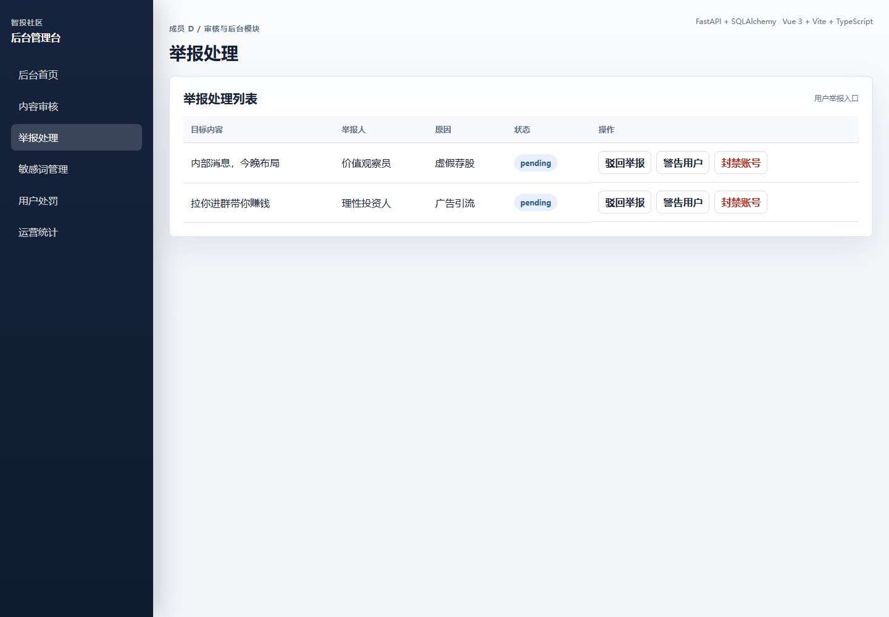

举报管理用于处理用户提交的帖子举报和评论举报。管理员可以查看举报原因、举报对象、提交时间，并进行处理。

### 4. 敏感词管理

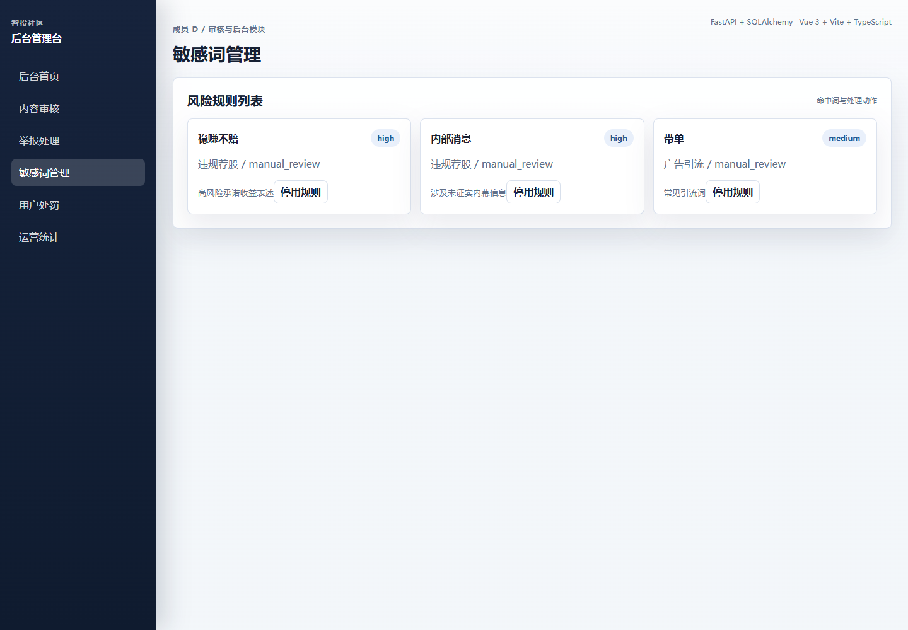

敏感词管理用于维护平台内容安全规则。管理员可以查看、新增或管理敏感词，配合审核模块完成内容治理。

### 5. 用户管理

管理员可以查看用户列表、用户状态和认证情况，并根据课程设计场景进行账号状态管理。

### 6. 统计看板

统计看板用于查看系统运行数据，例如用户增长、内容数量、互动数量和举报处理情况。

## 十六、移动端访问

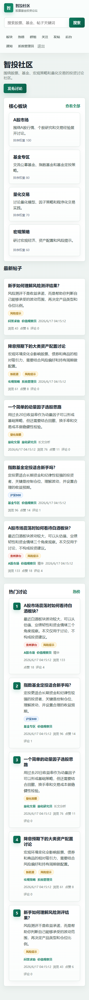

系统页面支持响应式布局。在手机或窄屏浏览器中访问时，首页、帖子卡片、导航和主要内容会按移动端宽度重新排列，方便课堂演示移动端适配效果。

## 十七、功能总表

| 功能模块 | 功能项 |
| --- | --- |
| 游客浏览 | 首页浏览、板块浏览、帖子详情、搜索结果、热榜、公开群组浏览 |
| 账号系统 | 注册、登录、退出、当前用户信息、权限识别 |
| 用户资料 | 资料查看、资料编辑、公开主页、积分等级、隐私设置 |
| 认证测评 | 实名认证、专业认证、风险测评 |
| 论坛内容 | 板块列表、板块详情、帖子列表、帖子详情、普通发帖、长文分析、投票帖、短动态、标签 |
| 搜索热榜 | 关键词搜索、搜索建议、热门话题、热榜列表 |
| 帖子互动 | 点赞、收藏、关注作者、举报帖子、附件查看、投票 |
| 评论互动 | 发表评论、回复评论、评论列表、举报评论 |
| 社交关系 | 关注用户、取消关注、关注动态、用户公开主页 |
| 消息通知 | 通知列表、标记已读、私信发送、私信查看 |
| 群组交流 | 群组列表、群组详情、创建群组、加入群组、申请加入、退出群组、群内讨论、群组资源 |
| 后台管理 | 后台概览、审核管理、举报管理、敏感词管理、用户管理、统计看板、管理员权限控制 |
| 部署演示 | 本地运行、Swagger 接口文档、云端演示、移动端适配 |

## 十八、使用注意事项

- 系统内容仅用于课程设计演示，不构成真实投资建议。
- 演示账号密码统一为 `Admin123456`，请勿用于真实业务系统。
- 普通用户无法进入后台管理页面；后台功能需使用管理员账号。
- 长文分析建议使用专业用户账号演示。
- 若本地数据库被删除，重新启动后端会重新生成演示数据。

## 十九、使用结论

智投社区已经覆盖股票基金投资论坛的主要业务流程：游客浏览、用户登录注册、论坛内容发布、评论互动、收藏关注、群组交流、通知私信和后台审核管理。按照本文档操作，可完成课程设计演示所需的主要功能展示。
