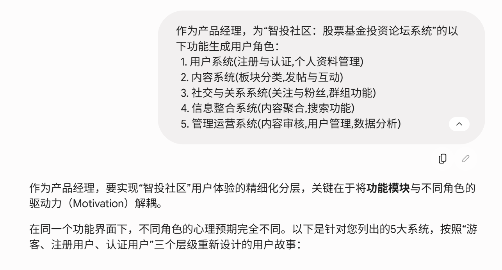
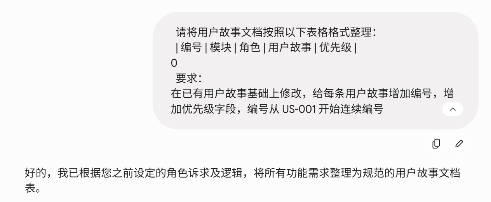
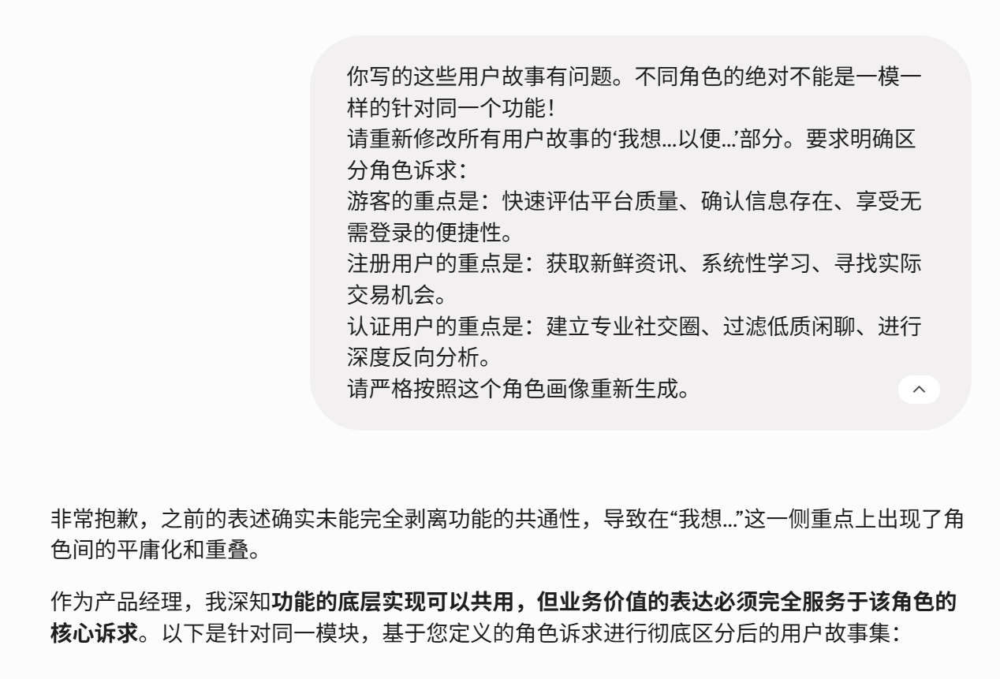
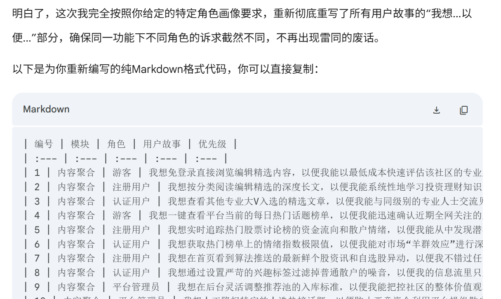
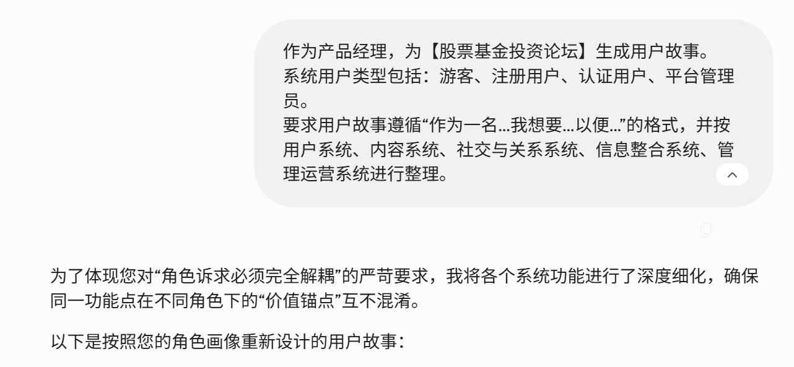
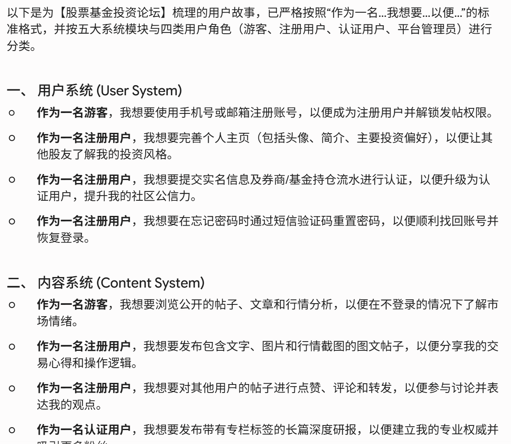
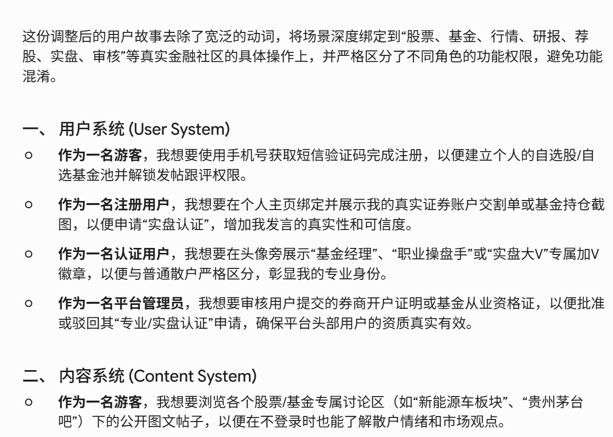
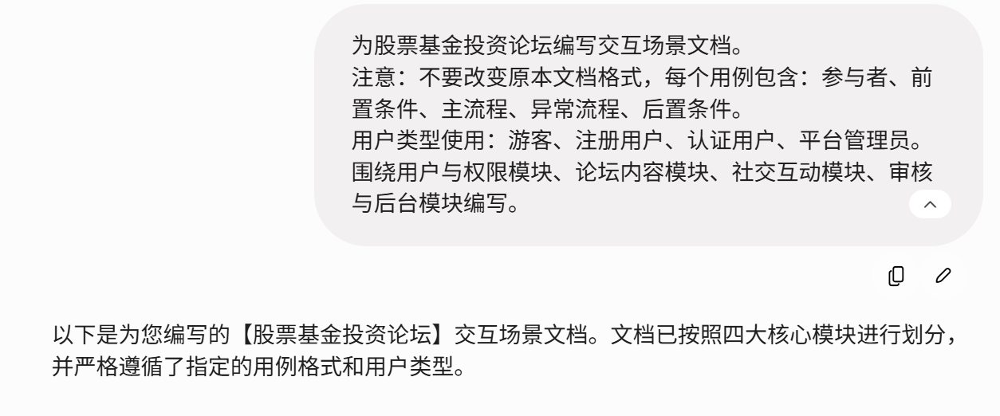
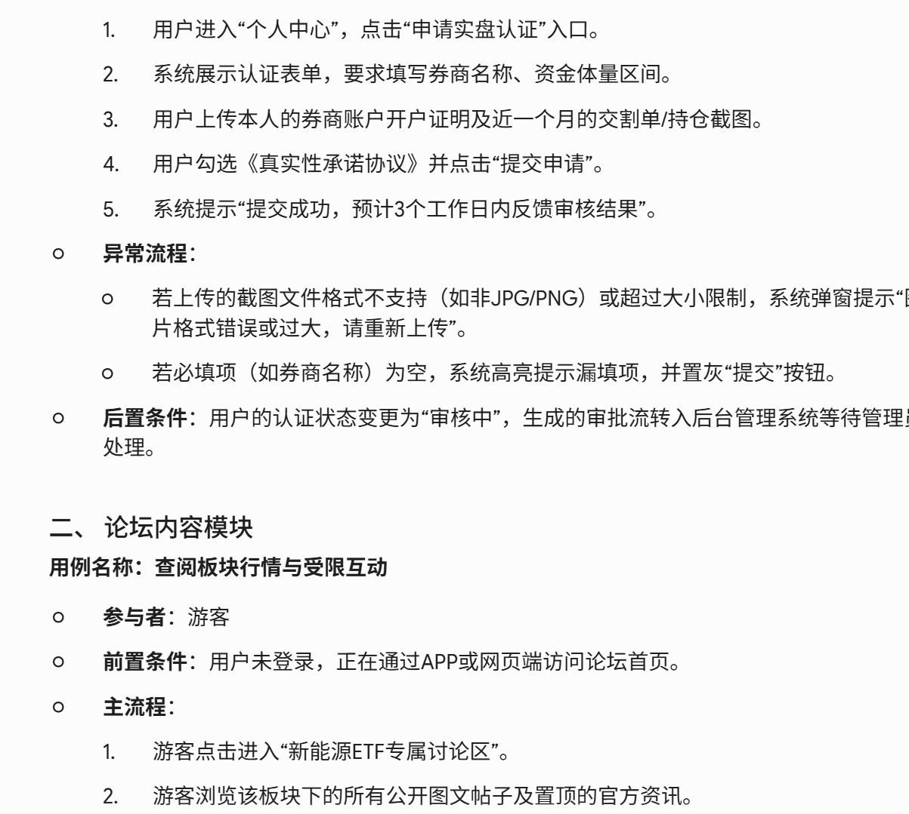
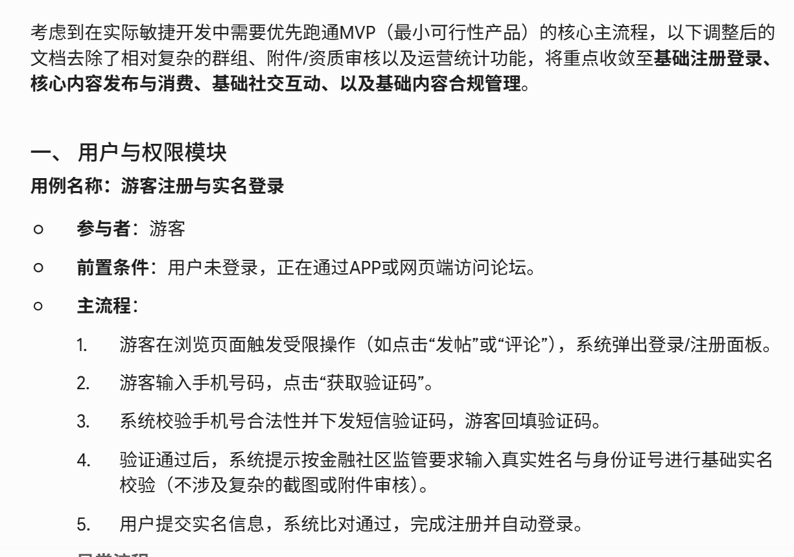

# AI 使用记录

## 用户故事文档——AI交互记录

### 用户故事交互记录1

#### 原始提示词
作为产品经理，为“智投社区：股票基金投资论坛系统”的以下功能生成用户角色：
  1. 用户系统(注册与认证,个人资料管理)
  2. 内容系统(板块分类,发帖与互动)
  3. 社交与关系系统(关注与粉丝,群组功能)
  4. 信息整合系统(内容聚合,搜索功能)
  5. 管理运营系统(内容审核,用户管理,数据分析)

#### AI 输出摘要
AI分出了8个不同角色如下：
  

#### 人工检查
AI的输出中角色分类有些多和冗余，可能导致用户故事太过庞大复杂，因此进行精简。

#### 迭代优化
精简为四类角色，足够覆盖系统用户：

### 用户故事交互记录2

### 原始提示词
  请将用户故事文档按照以下表格格式整理：
  | 编号 | 模块 | 角色 | 用户故事 | 优先级 |
0
  要求：
在已有用户故事基础上修改，给每条用户故事增加编号，增加优先级字段，编号从 US-001 开始连续编号

### AI 输出摘要
AI 将前三个模块的用户故事整理为统一表格，增加了编号、模块、角色、用户故事和优先级五列，并标注高、中、低优先级。

### 人工检查
人工检查发现ai生成的单张大表不够模块化，因此要求ai保留原来的二级标题结构，对每个系统模块继续细分。

### 迭代优化
采用表格字段、编号和优先级，但调整文档层级。

### 用户故事交互记录3

#### 原始提示词
你写的这些用户故事有问题。不同角色的绝对不能是一模一样的针对同一个功能！
请重新修改所有用户故事的‘我想...以便...’部分。要求明确区分角色诉求：
游客的重点是：快速评估平台质量、确认信息存在、享受无需登录的便捷性。
注册用户的重点是：获取新鲜资讯、系统性学习、寻找实际交易机会。
认证用户的重点是：建立专业社交圈、过滤低质闲聊、进行深度反向分析。
请严格按照这个角色画像重新生成。

### AI 输出摘要
AI 确认了逻辑错误，深刻理解了角色画像的差异，对所有故事的后半段进行了精准的语义重构。
重构后的内容成功体现了角色差异，消除了同质化。

### 人工检查
发现ai还是将某些角色之间的功能混淆，对不同角色提出了相同的用户故事

### 迭代优化
生成完整的不同角色对应不同的用户故事，满足需求

## 交互场景文档——AI交互记录

### 交互场景交互记录1

#### 原始提示词

作为产品经理，为【股票基金投资论坛】生成用户故事。
系统用户类型包括：游客、注册用户、认证用户、平台管理员。
要求用户故事遵循“作为一名…我想要…以便...”的格式，并按用户系统、内容系统、社交与关系系统、信息整合系统、管理运营系统进行整理。

#### AI输出摘要

AI 先按照股票基金投资论坛的大致功能，把注册登录、认证申请等功能点列了出来，并整理成用户故事。

#### 人工检查

发现有些句子比较空，比如只是写“管理内容”“查看信息”，需要改成和股票、基金、帖子、板块、审核有关的具体说法。

#### 迭代优化

让ai重新生成了用户故事，让他具体一点

### 交互场景交互记录2

#### 原始提示词

为股票基金投资论坛编写交互场景文档。
注意：不要改变原本文档格式，每个用例包含：参与者、前置条件、主流程、异常流程、后置条件。
用户类型使用：游客、注册用户、认证用户、平台管理员。
围绕用户与权限模块、论坛内容模块、社交互动模块、审核与后台模块编写。

#### AI输出摘要

AI 根据已有的四个模块标题，把原来空着的“待补充”部分扩展成具体交互场景。内容主要覆盖游客浏览公开内容、注册登录等场景。

#### 人工检查

考虑到真正开发时可能会先做核心流程，群组、附件审核、运营统计这些功能要看后面进度。于是让ai修改了一下

#### 迭代优化

