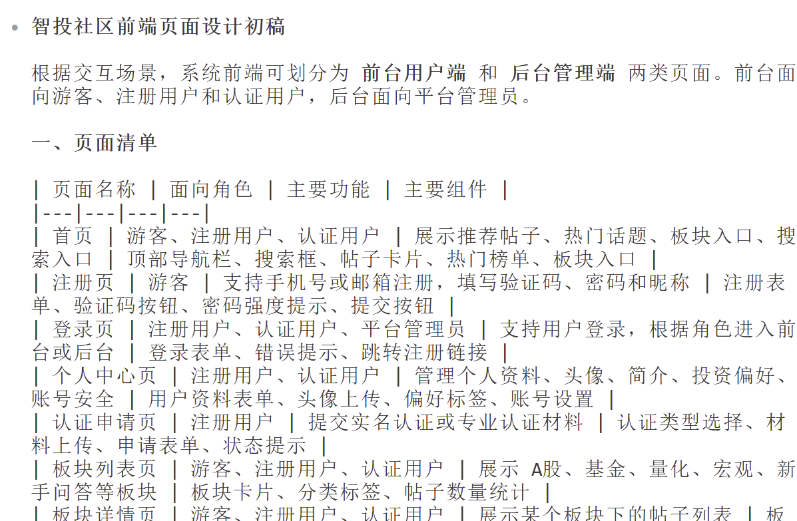
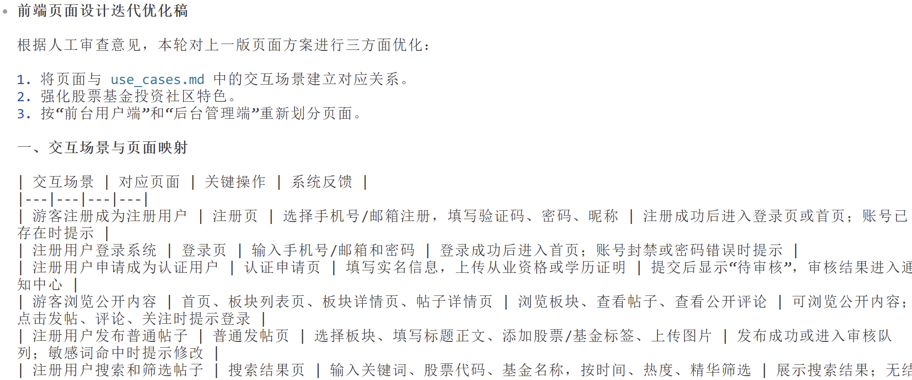
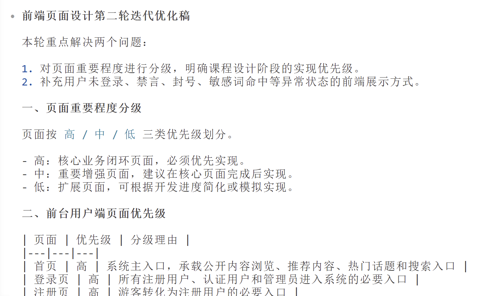
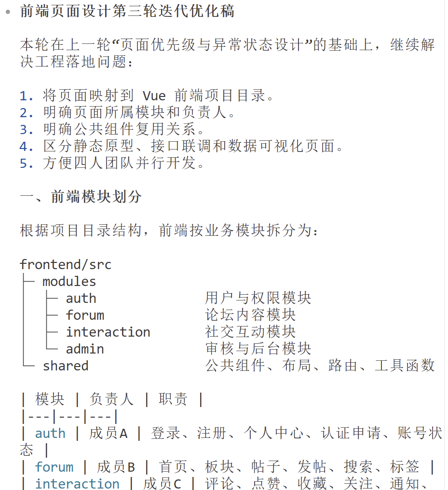

# AI 使用记录

## 架构和类设计

## 前端UI

### 原始提示词  
根据目录下的用户交互场景脚本（（模块1）use_cases.md）中的交互场景和用户故事（（模块1）user_stories.md）中的角色的定义以及需求，设计前端ui界面。

### AI输出截图

### 人发现可能的问题
AI的初稿能够覆盖大部分页面，但是页面只是按功能罗列，没有和user_cases里面的具体交互场景对应起来。页面类似普通论坛的，没有突出股票基金社区特点。然后有点混乱，没有按照前台和后台分。

### 迭代优化（提示词）
请根据上一轮输出进行迭代优化。1.你的初稿能够覆盖大部分页面，但是页面只是按功能罗列，没有和user_cases里面的具体交互场景对应起来。2.页面类似普通论坛的，没有突出股票基金社区特点。3.然后有点混乱，没有按照前台和后台分。

### AI输出截图

### 人发现可能的问题
迭代后输出有了页面和交互场景的对应关系，也增强了金融社区的特点。但是没有标准的对页面重要程度做分级，对用户未登录、禁言、封号、敏感词命中等异常状态的不同前端展示没有设计。

### 迭代优化（提示词）
请根据上一轮输出进行迭代优化。需要对页面重要程度做分级，对用户未登录、禁言、封号、敏感词命中等异常状态的不同前端展示做设计。

### AI输出截图

### 人发现可能的问题
整体设计基本上可行，但页面还没有和前端项目目录，模块分工等复用关系对应起来。要继续明确哪些页面由哪个模块负责，还有要不要复用，静态原型，接口联调等。

### 迭代优化（提示词）
请根据上一轮输出进行迭代优化。要把页面和前端项目目录，模块分工等复用关系对应起来。要继续明确哪些页面由哪个模块负责，还有要不要复用，静态原型，接口联调等。

### AI输出截图

### 最终结果
迭代后前端ui设计基本完善可用了，页面被映射到不同模块与交互场景，明确了公共组件复用关系，减少重复开发。区分了静态原型、接口联调和数据可视化任务。能够指导后续开发。

## 后端接口

## 数据库设计
