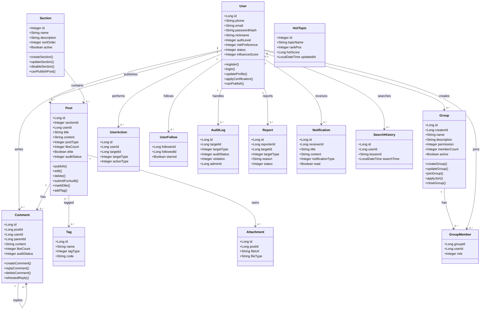

# 架构与类设计文档

项目名称：智投社区：股票基金投资论坛系统

本文档依据 `（模块1）user_stories.md` 中的用户故事、`（模块1）use_cases.md` 中的交互场景，以及模块 2 已完成的数据库设计和前端 UI 设计，整理智投社区的总体架构、技术选型、模块划分、核心业务对象、类属性、类操作和类图。

## 一、编写目的

本文档用于在代码开发前统一系统的架构边界和核心类设计，帮助后端、前端、数据库和测试成员对系统对象形成一致理解。

本文档重点解决以下问题：

- 系统采用什么总体架构和技术栈。
- 后端按照哪些层次和模块组织代码。
- 从需求中提取哪些核心业务类。
- 核心类之间存在什么关系。
- 核心类与数据库表、后端接口、前端页面如何对应。
- 哪些设计属于课程设计阶段必须实现，哪些可以作为后续扩展。

## 二、需求输入与设计范围

### 1. 需求输入来源

架构与类设计主要参考以下材料：

| 输入来源 | 作用 |
| --- | --- |
| `（模块1）user_stories.md` | 提供系统角色、功能需求和优先级 |
| `（模块1）use_cases.md` | 提供用户操作流程、异常流程和后置条件 |
| `（模块2）db.md` | 提供数据库实体、表结构和字段约定 |
| `（模块2）ui_design.md` | 提供前端页面、路由、组件和模块分工 |
| 群聊给出的核心对象 | 约束核心类命名和主要属性 |

### 2. 系统角色

| 角色 | 架构关注点 |
| --- | --- |
| 游客 | 可浏览公开内容，但不能进行发帖、评论、点赞、收藏、关注、加入群组等操作 |
| 注册用户 | 可完成注册登录、发帖、评论、点赞、收藏、关注、加入群组等社区核心操作 |
| 认证用户 | 在注册用户能力基础上，可发布长文分析并展示认证标识 |
| 平台管理员 | 可管理板块、审核内容、处理举报、维护敏感词和查看运营统计 |

### 3. 设计范围

本次架构与类设计覆盖以下核心业务域：

- 用户与权限模块
- 论坛内容模块
- 社交互动模块
- 审核与后台模块
- 搜索与信息整合模块

其中核心业务对象必须使用以下命名：

| 类名 | 中文名称 | 业务含义 |
| --- | --- | --- |
| `User` | 用户 | 注册并使用论坛的投资者和管理员 |
| `Section` | 板块 | 股票基金讨论专区 |
| `Post` | 帖子 | 用户在板块内发布的投资内容 |
| `Comment` | 评论 | 用户对帖子或评论的讨论回复 |
| `Group` | 群组 | 用户自建的投资主题交流圈 |

## 三、总体架构设计

### 1. 架构风格

智投社区采用前后端分离的 B/S 架构。

```text
浏览器 / 前端 Vue 应用
        |
        | HTTP + JSON + JWT
        v
FastAPI 后端 RESTful API
        |
        | SQLAlchemy ORM
        v
SQLite / MySQL 数据库
```

### 2. 架构分层

后端采用典型分层结构，每一层只关注自己的职责。

| 层次 | 主要职责 | 示例对象 |
| --- | --- | --- |
| Router 层 | 接收 HTTP 请求，校验基础参数，返回统一响应 | `forum/router.py`、`auth/router.py` |
| Service 层 | 编排业务流程，处理权限、状态、审核等业务规则 | `PostService`、`AuditService` |
| Model 层 | 使用 SQLAlchemy 映射数据库表结构 | `User`、`Post`、`Comment` |
| Schema 层 | 使用 Pydantic 接收请求参数并定义响应结构 | `PostCreate`、`LoginRequest` |
| Common 层 | 通用响应、错误码、分页、异常处理 | `ApiResponse`、`ErrorCode` |
| Security 层 | JWT 认证、登录状态、权限校验 | `JwtTokenProvider`、`SecurityContext` |

### 3. 部署视图

```text
用户浏览器
  |
  | 访问静态资源与接口
  v
前端应用 Vue 3 + Vite
  |
  | /api/**
  v
后端服务 FastAPI
  |
  | SQLAlchemy
  v
SQLite（默认开发）/ MySQL 8.0（可选部署）
```

课程设计阶段可以采用单机部署：

- 前端运行在 `localhost:5173`
- 后端运行在 `localhost:8000`
- 开发阶段默认使用本地 SQLite；需要部署到 MySQL 时再导入 `database/schema.sql` 和 `database/seed.sql`

## 四、技术选型

### 1. 后端技术选型

| 技术 | 用途 | 选择原因 |
| --- | --- | --- |
| FastAPI | 后端基础框架 | 原生支持 OpenAPI，适合快速构建 RESTful API |
| Uvicorn | ASGI 运行服务 | 支持本地开发和接口联调 |
| SQLAlchemy 2.0 | 数据访问层 | 统一管理模型映射、查询和事务 |
| SQLite | 开发数据库 | 便于本地冷启动、演示数据初始化和课程验收复现 |
| MySQL 8.0 | 可选部署数据库 | 支持事务、索引和外键，适合后续部署扩展 |
| JWT | 登录认证 | 前后端分离场景下便于无状态认证 |
| Pydantic | 参数校验 | 统一处理注册、发帖、评论等表单校验 |
| OpenAPI 3.0 | 接口文档 | 便于前后端接口联调和答辩展示 |

### 2. 前端技术选型

| 技术 | 用途 | 选择原因 |
| --- | --- | --- |
| Vue 3 | 前端框架 | 组件化开发，适合中小型课程项目 |
| Vite | 构建工具 | 启动快，配置简单 |
| TypeScript | 类型约束 | 提升接口数据、组件参数和路由开发的可维护性 |
| Vue Router | 路由管理 | 支持前台和后台路由拆分 |
| 原生 CSS 组件样式 | UI 实现 | 当前仓库未引入第三方 UI 组件库，统一使用项目内样式类 |

### 3. 数据库技术选型

| 技术 | 用途 | 选择原因 |
| --- | --- | --- |
| SQLite | 默认开发存储 | 首次启动自动创建本地演示库，便于快速运行 |
| MySQL 8.0 | 可选部署存储 | 适合用户、帖子、评论、群组等结构化数据 |
| InnoDB | 存储引擎 | 支持事务和外键约束 |
| utf8mb4 | 字符集 | 支持中文、金融符号和 Emoji |

## 五、后端工程结构设计

后端工程按照模块化方式组织，每个业务模块内部保持一致结构。

```text
backend/app
├─ main.py
├─ config.py
├─ database.py
├─ common
│  ├─ response.py
│  ├─ exceptions.py
│  └─ deps.py
├─ security
│  ├─ jwt.py
│  └─ password.py
└─ modules
   ├─ auth
   │  ├─ router.py
   │  ├─ service.py
   │  ├─ models.py
   │  └─ schemas.py
   ├─ forum
   │  ├─ router.py
   │  ├─ crud.py
   │  ├─ models.py
   │  └─ schemas.py
   ├─ interaction
   │  ├─ router.py
   │  ├─ service.py
   │  ├─ models.py
   │  └─ schemas.py
   └─ admin
      ├─ router.py
      ├─ service.py
      ├─ models.py
      └─ schemas.py
```

### 1. 模块职责

| 模块 | 目录 | 主要职责 |
| --- | --- | --- |
| 用户与权限 | `modules/auth` | 注册、登录、个人资料、认证申请、账号状态 |
| 论坛内容 | `modules/forum` | 板块、帖子、标签、搜索、附件 |
| 社交互动 | `modules/interaction` | 评论、点赞、收藏、关注、群组、通知 |
| 审核后台 | `modules/admin` | 内容审核、举报处理、敏感词、用户管理、运营统计 |
| 公共基础 | `common`、`config`、`security` | 统一响应、异常处理、JWT、跨域、分页 |

### 2. 类命名约定

| 类型 | 命名示例 | 说明 |
| --- | --- | --- |
| Model | `User`、`Post` | SQLAlchemy 模型，与数据库表对应 |
| Schema | `UserRegisterRequest`、`PostCreate` | Pydantic 请求或响应结构 |
| Router | `router.py` | FastAPI 接口入口 |
| Service | `service.py` | 业务逻辑与权限状态处理 |
| CRUD | `crud.py` | 查询和写入封装，当前主要用于论坛内容模块 |

## 六、类提取与迭代优化过程

### 1. 初始类提取

根据用户故事和交互场景，初始可提取出以下候选类：

| 候选类 | 来源需求 | 初始判断 |
| --- | --- | --- |
| `User` | 注册、登录、个人中心、认证、管理员 | 核心类 |
| `Section` | 板块列表、板块管理、发帖选择板块 | 核心类 |
| `Post` | 发帖、浏览、搜索、审核、精华 | 核心类 |
| `Comment` | 评论、回复、楼中楼、评论审核 | 核心类 |
| `Group` | 群组创建、加入、群组详情 | 核心类 |
| `UserProfile` | 个人资料、投资偏好、认证等级 | 可与 `User` 关联 |
| `Attachment` | 图片、PDF、Excel 上传 | 辅助类 |
| `Tag` | 股票代码、基金名称、主题标签 | 辅助类 |
| `UserFollow` | 关注、粉丝、特别关注 | 关系类 |
| `GroupMember` | 用户加入群组 | 关系类 |
| `UserAction` | 点赞、收藏 | 行为类 |
| `AuditLog` | 审核记录 | 后台类 |
| `Report` | 用户举报 | 后台类 |
| `Notification` | 评论、关注、审核通知 | 辅助类 |
| `SearchHistory` | 搜索历史 | 信息整合类 |
| `HotTopic` | 热榜缓存 | 信息整合类 |

### 2. 类筛选原则

为避免类图过于庞大，采用以下筛选原则：

- 与五个核心业务对象直接相关的类保留。
- 数据库中已经设计的表对应类优先保留。
- 只用于页面展示的临时概念不单独建核心类。
- 点赞、收藏、关注、群成员等多对多关系使用关系类表达。
- 私信、复杂推荐、算法权重等低优先级功能作为扩展设计，不进入核心类图主体。

### 3. 最终类设计结果

最终类分为三类：

| 类型 | 类名 | 说明 |
| --- | --- | --- |
| 核心实体类 | `User`、`Section`、`Post`、`Comment`、`Group` | 系统主业务对象 |
| 关系与行为类 | `UserFollow`、`GroupMember`、`UserAction`、`PostTag` | 表达多对多关系和用户操作 |
| 管理与辅助类 | `Attachment`、`Tag`、`AuditLog`、`Report`、`Notification` | 支撑附件、标签、审核、举报和通知 |
| 信息整合类 | `SearchHistory`、`HotTopic` | 支撑搜索记录、搜索联想和热门话题展示 |

## 七、核心业务对象设计

### 1. 用户类 `User`

#### 业务含义

`User` 表示注册并使用智投社区的用户，包括游客注册后的普通注册用户、认证用户和平台管理员。

#### 核心属性

| 属性 | 类型 | 说明 |
| --- | --- | --- |
| `id` | `Long` | 用户唯一标识 |
| `phone` | `String` | 手机号 |
| `email` | `String` | 邮箱 |
| `passwordHash` | `String` | 密码哈希 |
| `nickname` | `String` | 昵称 |
| `avatarUrl` | `String` | 头像地址 |
| `bio` | `String` | 个人简介 |
| `authLevel` | `Integer` | 认证等级：基础、实名、专业 |
| `riskPreference` | `Integer` | 风险偏好：保守、稳健、积极 |
| `status` | `Integer` | 账号状态：正常、禁言、封禁 |
| `influenceScore` | `Integer` | 影响力值 |
| `createdAt` | `LocalDateTime` | 注册时间 |
| `updatedAt` | `LocalDateTime` | 更新时间 |

#### 主要操作

| 操作 | 说明 |
| --- | --- |
| `register()` | 注册账号 |
| `login()` | 登录系统 |
| `updateProfile()` | 修改个人资料 |
| `applyCertification()` | 提交认证申请 |
| `changePassword()` | 修改密码 |
| `ban()` | 禁言用户 |
| `block()` | 封禁用户 |
| `isAdmin()` | 判断是否为管理员 |
| `canPublish()` | 判断是否可以发帖或评论 |

### 2. 板块类 `Section`

#### 业务含义

`Section` 表示论坛中的内容分类专区，例如 A 股市场、基金专区、量化交易、问答求助等。

#### 核心属性

| 属性 | 类型 | 说明 |
| --- | --- | --- |
| `id` | `Integer` | 板块唯一标识 |
| `name` | `String` | 板块名称 |
| `description` | `String` | 板块描述 |
| `sortOrder` | `Integer` | 排序权重 |
| `active` | `Boolean` | 是否启用 |
| `createdAt` | `LocalDateTime` | 创建时间 |

#### 主要操作

| 操作 | 说明 |
| --- | --- |
| `createSection()` | 创建板块 |
| `updateSection()` | 修改板块信息 |
| `disableSection()` | 停用板块 |
| `enableSection()` | 启用板块 |
| `changeSortOrder()` | 调整板块排序 |
| `canPublishPost()` | 判断板块是否允许发帖 |

### 3. 帖子类 `Post`

#### 业务含义

`Post` 表示用户在某个板块内发布的投资讨论内容，包括普通帖、长文分析、投票帖和短动态。

#### 核心属性

| 属性 | 类型 | 说明 |
| --- | --- | --- |
| `id` | `Long` | 帖子唯一标识 |
| `sectionId` | `Integer` | 所属板块 ID |
| `userId` | `Long` | 发布者 ID |
| `title` | `String` | 标题 |
| `content` | `String` | 正文内容 |
| `postType` | `Integer` | 帖子类型 |
| `likeCount` | `Integer` | 点赞数 |
| `commentCount` | `Integer` | 评论数 |
| `favoriteCount` | `Integer` | 收藏数 |
| `elite` | `Boolean` | 是否精华 |
| `auditStatus` | `Integer` | 审核状态 |
| `createdAt` | `LocalDateTime` | 发布时间 |
| `updatedAt` | `LocalDateTime` | 更新时间 |

#### 主要操作

| 操作 | 说明 |
| --- | --- |
| `publish()` | 发布帖子 |
| `edit()` | 编辑帖子 |
| `delete()` | 删除帖子 |
| `submitForAudit()` | 提交审核 |
| `markElite()` | 设置精华 |
| `increaseLikeCount()` | 增加点赞数 |
| `decreaseLikeCount()` | 减少点赞数 |
| `addTag()` | 添加股票、基金或主题标签 |
| `isVisibleTo()` | 判断帖子对某用户是否可见 |

### 4. 评论类 `Comment`

#### 业务含义

`Comment` 表示用户对帖子或其他评论发表的讨论内容。`parentId` 为空时表示一级评论，不为空时表示楼中楼回复。

#### 核心属性

| 属性 | 类型 | 说明 |
| --- | --- | --- |
| `id` | `Long` | 评论唯一标识 |
| `postId` | `Long` | 所属帖子 ID |
| `userId` | `Long` | 评论发布者 ID |
| `parentId` | `Long` | 父级评论 ID |
| `content` | `String` | 评论内容 |
| `likeCount` | `Integer` | 点赞数 |
| `auditStatus` | `Integer` | 审核状态 |
| `createdAt` | `LocalDateTime` | 评论时间 |

#### 主要操作

| 操作 | 说明 |
| --- | --- |
| `createComment()` | 发表评论 |
| `replyComment()` | 回复评论 |
| `deleteComment()` | 删除评论 |
| `increaseLikeCount()` | 增加点赞数 |
| `submitForAudit()` | 提交审核 |
| `isNestedReply()` | 判断是否楼中楼回复 |

### 5. 群组类 `Group`

#### 业务含义

`Group` 表示用户围绕股票、基金、行业或投资策略创建的主题交流圈。

#### 核心属性

| 属性 | 类型 | 说明 |
| --- | --- | --- |
| `id` | `Long` | 群组唯一标识 |
| `creatorId` | `Long` | 群主 ID |
| `name` | `String` | 群组名称 |
| `description` | `String` | 群组描述 |
| `permission` | `Integer` | 权限类型：公开、需审核、私密 |
| `memberCount` | `Integer` | 成员数量 |
| `active` | `Boolean` | 是否启用 |
| `createdAt` | `LocalDateTime` | 创建时间 |

#### 主要操作

| 操作 | 说明 |
| --- | --- |
| `createGroup()` | 创建群组 |
| `updateGroup()` | 修改群组信息 |
| `joinGroup()` | 加入群组 |
| `applyJoin()` | 申请加入群组 |
| `quitGroup()` | 退出群组 |
| `closeGroup()` | 关闭群组 |
| `canJoinDirectly()` | 判断是否可以直接加入 |

## 八、辅助类设计

### 1. 标签类 `Tag`

`Tag` 用于表达股票代码、基金名称和主题标签。

| 属性 | 类型 | 说明 |
| --- | --- | --- |
| `id` | `Long` | 标签 ID |
| `name` | `String` | 标签名称 |
| `tagType` | `Integer` | 标签类型：股票、基金、主题 |
| `code` | `String` | 股票或基金代码 |

### 2. 附件类 `Attachment`

`Attachment` 用于保存帖子或长文分析中的图片、PDF、Excel 等文件信息。

| 属性 | 类型 | 说明 |
| --- | --- | --- |
| `id` | `Long` | 附件 ID |
| `postId` | `Long` | 所属帖子 |
| `fileUrl` | `String` | 文件地址 |
| `fileType` | `String` | 文件类型 |
| `createdAt` | `LocalDateTime` | 上传时间 |

### 3. 用户行为类 `UserAction`

`UserAction` 统一记录点赞和收藏行为。

| 属性 | 类型 | 说明 |
| --- | --- | --- |
| `id` | `Long` | 行为 ID |
| `userId` | `Long` | 操作用户 |
| `targetId` | `Long` | 被操作对象 |
| `targetType` | `Integer` | 对象类型：帖子、评论 |
| `actionType` | `Integer` | 行为类型：点赞、收藏 |
| `createdAt` | `LocalDateTime` | 操作时间 |

### 4. 关注关系类 `UserFollow`

`UserFollow` 表示用户之间的关注关系。

| 属性 | 类型 | 说明 |
| --- | --- | --- |
| `followerId` | `Long` | 关注者 |
| `followedId` | `Long` | 被关注者 |
| `starred` | `Boolean` | 是否特别关注 |
| `createdAt` | `LocalDateTime` | 关注时间 |

### 5. 群成员类 `GroupMember`

`GroupMember` 表示用户与群组之间的成员关系。

| 属性 | 类型 | 说明 |
| --- | --- | --- |
| `groupId` | `Long` | 群组 ID |
| `userId` | `Long` | 用户 ID |
| `role` | `Integer` | 群内角色：群主、管理员、普通成员 |
| `joinTime` | `LocalDateTime` | 加入时间 |

### 6. 审核记录类 `AuditLog`

`AuditLog` 记录帖子、评论、附件等内容的审核结果。

| 属性 | 类型 | 说明 |
| --- | --- | --- |
| `id` | `Long` | 审核记录 ID |
| `targetId` | `Long` | 待审对象 ID |
| `targetType` | `Integer` | 对象类型 |
| `auditStatus` | `Integer` | 审核状态 |
| `violation` | `Integer` | 违规类型 |
| `adminId` | `Long` | 审核管理员 ID |
| `reason` | `String` | 审核意见 |

### 7. 举报类 `Report`

`Report` 表示用户对帖子、评论或用户的举报记录。

| 属性 | 类型 | 说明 |
| --- | --- | --- |
| `id` | `Long` | 举报 ID |
| `reporterId` | `Long` | 举报人 ID |
| `targetId` | `Long` | 被举报对象 ID |
| `targetType` | `Integer` | 被举报对象类型 |
| `reason` | `String` | 举报原因 |
| `status` | `Integer` | 处理状态 |

### 8. 通知类 `Notification`

`Notification` 用于记录评论、回复、点赞、关注、审核结果和系统通知。

| 属性 | 类型 | 说明 |
| --- | --- | --- |
| `id` | `Long` | 通知 ID |
| `receiverId` | `Long` | 接收用户 |
| `title` | `String` | 通知标题 |
| `content` | `String` | 通知内容 |
| `notificationType` | `Integer` | 通知类型 |
| `read` | `Boolean` | 是否已读 |
| `createdAt` | `LocalDateTime` | 创建时间 |

### 9. 搜索历史类 `SearchHistory`

`SearchHistory` 对应数据库设计中的 `search_history` 表，用于记录用户或游客的搜索行为，为搜索联想和运营分析提供数据来源。

| 属性 | 类型 | 说明 |
| --- | --- | --- |
| `id` | `Long` | 搜索记录 ID |
| `userId` | `Long` | 搜索用户 ID，游客搜索时可为空 |
| `keyword` | `String` | 搜索关键词、股票代码或基金名称 |
| `searchTime` | `LocalDateTime` | 搜索时间 |

### 10. 热门话题类 `HotTopic`

`HotTopic` 对应数据库设计中的 `hot_topics` 表，用于缓存热门股票、基金或话题排行，避免首页和搜索页频繁进行复杂统计查询。

| 属性 | 类型 | 说明 |
| --- | --- | --- |
| `id` | `Integer` | 热榜条目 ID |
| `topicName` | `String` | 热门股票名称或讨论话题 |
| `rankPos` | `Integer` | 排名位置 |
| `hotScore` | `Long` | 综合热度值 |
| `updatedAt` | `LocalDateTime` | 数据更新时间 |

## 九、类图设计



## 十、核心业务流程设计

### 1. 注册登录流程

```text
游客填写注册信息
  -> UserController 接收请求
  -> UserService 校验手机号/邮箱/验证码/密码强度
  -> UserMapper 写入 users 和 user_profiles
  -> 返回注册成功
  -> 登录时生成 JWT
```

### 2. 发帖流程

```text
注册用户提交帖子
  -> PostController 接收 PostCreateDTO
  -> Security 校验登录状态和账号状态
  -> SectionService 校验板块是否启用
  -> PostService 保存帖子
  -> SensitiveWordService 检查敏感词
  -> 低风险直接发布，高风险进入审核
  -> 返回帖子状态
```

### 3. 评论与回复流程

```text
用户在帖子详情页提交评论
  -> CommentController 接收请求
  -> 校验用户是否登录、是否禁言
  -> 校验帖子是否存在且可评论
  -> 保存 Comment
  -> 更新帖子评论数
  -> 生成 Notification 通知帖子作者
```

### 4. 审核流程

```text
帖子或评论进入审核队列
  -> 管理员进入后台内容审核页
  -> AuditController 查询待审内容
  -> 管理员选择通过、驳回、删除
  -> AuditLog 记录处理结果
  -> 更新 Post 或 Comment 审核状态
  -> Notification 通知内容作者
```

### 5. 群组加入流程

```text
用户点击加入群组
  -> GroupController 查询群组权限类型
  -> 公开群组直接写入 GroupMember
  -> 需审核群组生成申请记录
  -> 私密群组拒绝直接加入
```

## 十一、核心状态设计

### 1. 用户状态

| 状态 | 含义 | 业务影响 |
| --- | --- | --- |
| `NORMAL` | 正常 | 可以发帖、评论、点赞、收藏、关注 |
| `MUTED` | 禁言 | 可以浏览，不能发帖和评论 |
| `BANNED` | 封禁 | 禁止登录或强制退出 |

### 2. 认证等级

| 等级 | 含义 | 业务影响 |
| --- | --- | --- |
| `BASIC` | 基础用户 | 可使用普通社区功能 |
| `REAL_NAME` | 实名认证 | 可信度更高 |
| `PROFESSIONAL` | 专业认证 | 可发布长文分析并展示认证标识 |

### 3. 内容审核状态

| 状态 | 含义 | 展示规则 |
| --- | --- | --- |
| `PENDING` | 待审核 | 仅作者和管理员可见 |
| `PUBLISHED` | 已发布 | 所有可访问用户可见 |
| `REJECTED` | 已驳回 | 作者可见驳回原因 |
| `DELETED` | 已删除 | 普通用户不可见 |

## 十二、与数据库设计的对应关系

| 类名 | 数据库表 | 说明 |
| --- | --- | --- |
| `User` | `users`、`user_profiles` | 用户基础信息与扩展资料 |
| `Section` | `sections` | 论坛板块 |
| `Post` | `posts` | 帖子内容 |
| `Comment` | `comments` | 评论和楼中楼回复 |
| `Group` | `groups` | 投资主题群组 |
| `GroupMember` | `group_members` | 群成员关系 |
| `UserFollow` | `user_follows` | 关注关系 |
| `UserAction` | `user_actions` | 点赞和收藏 |
| `Attachment` | `attachments` | 文件附件 |
| `AuditLog` | `audit_logs` | 审核记录 |
| `Report` | `reports` | 举报记录 |
| `SearchHistory` | `search_history` | 搜索历史 |
| `HotTopic` | `hot_topics` | 热榜数据缓存 |

### 字段落地说明

本文档中的核心实体类以 `（模块2）db.md` 的表结构为主要落地依据，同时会保留少量面向业务层或前端展示的派生字段。派生字段不一定直接作为数据库字段保存，开发时可以通过关联查询、统计计算或 VO 组装得到。

| 类字段 | 来源或落地方式 |
| --- | --- |
| `Post.commentCount` | 可由 `comments` 表按 `post_id` 统计得到 |
| `Post.favoriteCount` | 可由 `user_actions` 表中收藏行为统计得到 |
| `Post.auditStatus` | 可由 `audit_logs` 表中最新审核记录推导得到，后续也可按需要补充到 `posts` 表 |
| `Comment.auditStatus` | 可由 `audit_logs` 表中评论审核记录推导得到 |
| `Group.memberCount` | 可由 `group_members` 表按 `group_id` 统计得到 |
| `Group.description`、`Group.active` | 业务和 UI 需要展示的扩展属性，若严格按当前 `db.md` 实现，可在后续数据库迭代中补充字段 |
| `Notification` | 当前 `db.md` 未单独建通知表，课程阶段可由审核记录、评论、关注等行为生成模拟通知，后续可扩展为独立表 |
| `Tag` | 当前 `db.md` 未单独建标签表，课程阶段可作为帖子标签字段或前端展示数据，后续可扩展为 `tags`、`post_tags` 表 |

## 十三、与接口设计的对应关系

| 类名 | 主要接口 |
| --- | --- |
| `User` | `/api/auth/register`、`/api/auth/login`、`/api/users/me`、`/api/users/{id}` |
| `Section` | `/api/sections`、`/api/admin/sections` |
| `Post` | `/api/posts`、`/api/posts/{id}`、`/api/admin/audits/posts` |
| `Comment` | `/api/posts/{postId}/comments`、`/api/comments/{id}` |
| `Group` | `/api/groups`、`/api/groups/{id}`、`/api/groups/{id}/join` |
| `UserFollow` | `/api/users/{id}/follow`、`/api/users/{id}/followers` |
| `UserAction` | `/api/posts/{id}/like`、`/api/posts/{id}/favorite` |
| `Report` | `/api/reports`、`/api/admin/reports` |

## 十四、架构风险与约束

| 风险 | 说明 | 处理方式 |
| --- | --- | --- |
| 功能范围过大 | 用户故事数量较多，全部实现工作量大 | 优先完成高优先级闭环，低优先级做模拟或扩展 |
| 互动数据一致性 | 点赞、收藏、评论数存在冗余计数 | 行为表记录明细，帖子表保留冗余计数并在 Service 层统一维护 |
| 审核流程复杂 | 帖子、评论、附件、举报均涉及审核 | 使用 `AuditLog` 统一记录审核行为 |
| 前后端字段不一致 | 页面、接口、数据库若命名不统一会影响联调 | 以本设计文档和 OpenAPI 文档统一字段 |
| 群组功能扩展多 | 群组审核、群内资料、群内帖子都可扩展 | 课程阶段先实现群组创建、列表、加入和成员关系 |

## 十五、最终采用方案

最终架构采用“前后端分离 + FastAPI 分层后端 + SQLAlchemy 数据访问 + SQLite 默认开发库 / MySQL 可选部署库”的设计。

后端按照 `auth`、`forum`、`interaction`、`admin` 四个业务模块拆分，公共能力放入 `common`、`config` 和 `security`。核心业务类采用 `User`、`Section`、`Post`、`Comment`、`Group` 五个对象作为主干，再使用 `UserFollow`、`GroupMember`、`UserAction`、`Attachment`、`Tag`、`AuditLog`、`Report`、`Notification` 等类补充关系和管理能力。

本设计既能覆盖注册登录、浏览板块、发帖评论、点赞收藏、关注群组、内容审核等课程展示核心闭环，也保留了搜索、通知、认证、统计等后续扩展空间。后续代码开发时，应优先实现高优先级业务流程，并严格保持类名、数据库表名和接口 schema 的一致性。
