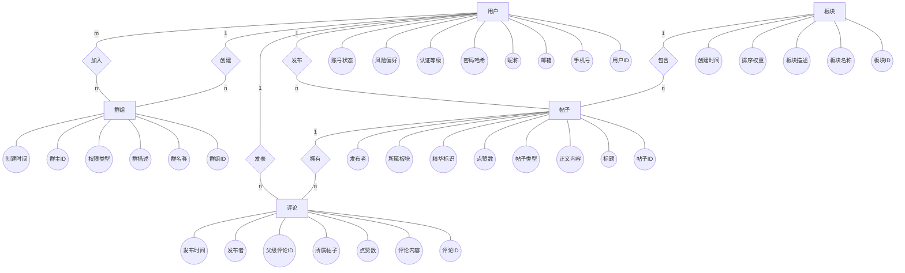

## 1. 引言

### 1.1 编写目的
本文档旨在详细阐述《股票基金投资论坛》系统的底层数据库架构与逻辑表结构设计。作为连接系统需求分析与后端代码实现的桥梁，本设计文档将为开发团队（特别是后端开发工程师、数据库管理员及测试人员）提供清晰、准确的数据存储标准。它是指导数据库环境搭建、API 接口数据对接、以及后续系统维护与性能优化的根本依据。

### 1.2 名词解释
为了消除团队开发过程中的理解歧义，特对本系统业务场景中的专有术语进行如下定义：

* **Feed流 (Feed Stream)**：一种持续更新的内容信息流展示方式。在本项目中，特指系统基于用户当前关注列表、投资偏好标签以及算法推荐，为用户在首页生成的个性化帖子阅读列表。
* **长文分析 (Long-form Analysis)**：论坛内一种结构更复杂、专业度更高的内容载体。相较于普通纯文本发帖，长文分析支持富文本编辑器排版，允许用户插入复杂图表，并支持挂载外部附件（如 PDF 格式的行业研报、Excel 格式的财务数据表等）。
* **量化投资专区**：论坛内划分的特定垂直板块，专供具有编程能力或进阶投资经验的用户，讨论基于数学模型和计算机算法驱动的程序化交易策略。
* **楼中楼 (Nested Comments)**：评论系统中的一种层级展示逻辑。指在某条一级主评论下方，直接嵌套显示其他用户针对该条评论的二级甚至多级回复，以便于聚焦特定子话题的讨论。
* **影响力值 (Influence Score)**：平台用于量化衡量用户在社区内贡献度和专业威望的数值指标，通常综合其发帖数量、被点赞/收藏次数以及精华帖数量计算得出。

### 1.3 开发环境与约定
为保证系统性能及数据安全，本系统底层数据的存储与管理环境作如下强制约定：

* **数据库管理系统 (DBMS)**：MySQL
* **版本要求**：MySQL 8.0 及以上版本 (MySQL 8.0+)
* **默认存储引擎**：InnoDB（强制使用，以支持事务处理、行级锁机制，保障高并发下的数据一致性与完整性）
* **默认字符集**：`utf8mb4`（必须使用此字符集，以全面兼容复杂的金融符号、多语言生僻字以及用户日常交流使用的 Emoji 表情）
* **排序规则 (Collation)**：推荐使用 `utf8mb4_unicode_ci`

## 2. 全局概念数据模型

本部分旨在从宏观业务角度，抽象出《股票基金投资论坛》系统中的核心数据实体，并明确实体之间的交互关联，为后续的数据库逻辑表设计奠定基础。

### 2.1 核心实体列举与属性描述

根据系统需求说明书，本系统主要提取出以下 5 个核心业务实体：

1. **用户 (User)**
   * **业务含义**：注册并使用论坛的各类投资者及平台管理员。
   * **核心属性**：用户ID、手机号、邮箱、昵称、密码哈希、认证等级（基础/实名/专业）、风险偏好、账号状态等。
2. **板块 (Section)**
   * **业务含义**：论坛的内容分类专区（如A股市场、量化投资专区等）。
   * **核心属性**：板块ID、板块名称、板块描述、排序权重、创建时间等。
3. **帖子 (Post)**
   * **业务含义**：用户在板块内发布的各类投资内容（包括普通帖、长文分析、投票等）。
   * **核心属性**：帖子ID、标题、正文内容、帖子类型、点赞数、精华标识、所属板块、发布者等。
4. **评论 (Comment)**
   * **业务含义**：用户针对帖子或他人评论发表的讨论与回复。
   * **核心属性**：评论ID、评论内容、点赞数、所属帖子、父级评论ID、发布者、发布时间等。
5. **群组 (Group)**
   * **业务含义**：用户自建的特定投资主题私域交流圈。
   * **核心属性**：群组ID、群名称、群描述、权限类型（公开/私密）、群主ID、创建时间等。

### 2.2 实体关系说明 (E-R 关联)

系统中核心实体之间的主要业务映射关系如下：

* **一对多 (1:N) 关系：**
  * **用户 -> 帖子**：一个用户可以发布多个帖子，一个帖子仅属于一个发布者。
  * **板块 -> 帖子**：一个板块包含多个帖子，一个帖子通常归属于一个主要板块。
  * **用户 -> 评论**：一个用户可以发表多条评论，一条评论仅属于一个发布者。
  * **帖子 -> 评论**：一个帖子下可以有多条评论，一条评论仅属于一个具体的帖子。
  * **用户 -> 群组 (创建)**：一个用户可以创建多个群组，一个群组只有一个群主。
* **多对多 (M:N) 关系：**
  * **用户 <-> 用户 (关注社交)**：一个用户可以关注多个其他用户，也可以拥有多个粉丝。
  * **用户 <-> 群组 (加入行为)**：一个用户可以加入多个群组，一个群组包含多名成员。

### 2.3 全局 E-R 图

## 3. 逻辑结构设计 / 数据字典

本节将全局概念模型转化为具体的数据库表结构。数据类型以 MySQL 8.0 规范为基准。

### 3.1 用户系统模块 (User System)

#### 1. 用户基础表 (`users`)
存储用户的核心身份凭证与账号生命周期信息。
| 字段名 (Field) | 数据类型 (Type) | 主/外键 (Key) | 允许为空 | 说明 (Description) |
| :--- | :--- | :--- | :--- | :--- |
| `id` | BIGINT | PK | 否 | 用户唯一自增标识 |
| `phone` | VARCHAR(20) | UK | 是 | 手机号（需唯一索引） |
| `email` | VARCHAR(100) | UK | 是 | 邮箱地址（需唯一索引） |
| `password_hash` | VARCHAR(255) | - | 否 | 加密后的密码哈希值 |
| `status` | TINYINT | - | 否 | 账号状态：0-正常, 1-禁言, 2-封禁 |
| `created_at` | DATETIME | - | 否 | 注册时间 |
| `updated_at` | DATETIME | - | 否 | 最后更新时间 |

#### 2. 用户扩展资料表 (`user_profiles`)
存储用户的个性化展示信息及认证等级。与 `users` 表为 1:1 关系，垂直拆分以提高查询效率。
| 字段名 (Field) | 数据类型 (Type) | 主/外键 (Key) | 允许为空 | 说明 (Description) |
| :--- | :--- | :--- | :--- | :--- |
| `user_id` | BIGINT | PK, FK | 否 | 关联 `users.id` |
| `nickname` | VARCHAR(50) | - | 否 | 论坛显示昵称 |
| `avatar_url` | VARCHAR(255) | - | 是 | 头像图片URL |
| `bio` | VARCHAR(255) | - | 是 | 个人简介 |
| `auth_level` | TINYINT | - | 否 | 认证等级：0-基础, 1-实名, 2-专业认证(大V) |
| `risk_preference`| TINYINT | - | 是 | 风险偏好：1-保守型, 2-稳健型, 3-进取型 |
| `influence_score`| INT | - | 否 | 影响力值（积分），默认 0 |

---

### 3.2 内容系统模块 (Content System)

#### 1. 板块表 (`sections`)
存储论坛的各个分区（如A股、美股、量化专区等）。
| 字段名 (Field) | 数据类型 (Type) | 主/外键 (Key) | 允许为空 | 说明 (Description) |
| :--- | :--- | :--- | :--- | :--- |
| `id` | INT | PK | 否 | 板块唯一标识 |
| `name` | VARCHAR(50) | - | 否 | 板块名称 |
| `description` | VARCHAR(255) | - | 是 | 板块描述 |
| `sort_order` | INT | - | 否 | 排序权重（值越大越靠前） |
| `is_active` | TINYINT | - | 否 | 是否启用：0-隐藏, 1-展示 |

#### 2. 帖子表 (`posts`)
存储用户发布的各类投资内容。
| 字段名 (Field) | 数据类型 (Type) | 主/外键 (Key) | 允许为空 | 说明 (Description) |
| :--- | :--- | :--- | :--- | :--- |
| `id` | BIGINT | PK | 否 | 帖子唯一标识 |
| `section_id` | INT | FK | 否 | 所属板块ID，关联 `sections.id` |
| `user_id` | BIGINT | FK | 否 | 发布者ID，关联 `users.id` |
| `title` | VARCHAR(100) | - | 否 | 帖子标题 |
| `post_type` | TINYINT | - | 否 | 类型：1-普通, 2-长文, 3-投票, 4-短动态 |
| `content` | LONGTEXT | - | 否 | 帖子正文（支持富文本/Markdown） |
| `like_count` | INT | - | 否 | 冗余点赞数，提高查询性能 |
| `is_elite` | TINYINT | - | 否 | 是否加精：0-否, 1-是 |
| `created_at` | DATETIME | - | 否 | 发布时间 |

#### 3. 评论表 (`comments`)
存储帖子下方的回复及楼中楼回复。
| 字段名 (Field) | 数据类型 (Type) | 主/外键 (Key) | 允许为空 | 说明 (Description) |
| :--- | :--- | :--- | :--- | :--- |
| `id` | BIGINT | PK | 否 | 评论唯一标识 |
| `post_id` | BIGINT | FK | 否 | 所属帖子ID，关联 `posts.id` |
| `user_id` | BIGINT | FK | 否 | 评论者ID，关联 `users.id` |
| `parent_id` | BIGINT | FK | 是 | 父级评论ID（为空则是直接回复帖子，有值则是楼中楼） |
| `content` | TEXT | - | 否 | 评论正文 |
| `like_count` | INT | - | 否 | 点赞数 |
| `created_at` | DATETIME | - | 否 | 评论时间 |

#### 4. 附件表 (`attachments`)
存储长文分析或普通帖子中附带的研报、Excel等文件。
| 字段名 (Field) | 数据类型 (Type) | 主/外键 (Key) | 允许为空 | 说明 (Description) |
| :--- | :--- | :--- | :--- | :--- |
| `id` | BIGINT | PK | 否 | 附件唯一标识 |
| `post_id` | BIGINT | FK | 否 | 归属的帖子ID |
| `file_url` | VARCHAR(255) | - | 否 | 文件存储路径 (OSS/S3 等) |
| `file_type` | VARCHAR(20) | - | 否 | 文件格式（pdf, excel, jpg等） |
| `created_at` | DATETIME | - | 否 | 上传时间 |

#### 5. 用户互动行为表 (`user_actions`)
记录用户的点赞、收藏等动作，用于防重复操作及后续的数据分析。
| 字段名 (Field) | 数据类型 (Type) | 主/外键 (Key) | 允许为空 | 说明 (Description) |
| :--- | :--- | :--- | :--- | :--- |
| `id` | BIGINT | PK | 否 | 记录自增标识 |
| `user_id` | BIGINT | FK | 否 | 触发操作的用户ID |
| `target_id` | BIGINT | - | 否 | 被操作对象的ID（帖子ID或评论ID） |
| `target_type` | TINYINT | - | 否 | 对象类型：1-帖子, 2-评论 |
| `action_type` | TINYINT | - | 否 | 动作类型：1-点赞, 2-收藏 |
| `created_at` | DATETIME | - | 否 | 操作时间 |

---

### 3.3 社交与关系系统模块 (Social System)

#### 1. 关注关系表 (`user_follows`)
| 字段名 (Field) | 数据类型 (Type) | 主/外键 (Key) | 允许为空 | 说明 (Description) |
| :--- | :--- | :--- | :--- | :--- |
| `follower_id` | BIGINT | PK, FK| 否 | 粉丝ID（发起关注的人） |
| `followed_id` | BIGINT | PK, FK| 否 | 被关注者ID（大V或普通用户） |
| `is_starred` | TINYINT | - | 否 | 是否为特别关注(星标)：0-否, 1-是 |
| `created_at` | DATETIME | - | 否 | 关注建立时间 |
*(注：主键为 `follower_id` 和 `followed_id` 的联合主键)*

#### 2. 群组表 (`groups`)
| 字段名 (Field) | 数据类型 (Type) | 主/外键 (Key) | 允许为空 | 说明 (Description) |
| :--- | :--- | :--- | :--- | :--- |
| `id` | BIGINT | PK | 否 | 群组唯一标识 |
| `creator_id` | BIGINT | FK | 否 | 群主（创建者）ID |
| `name` | VARCHAR(50) | - | 否 | 群组名称 |
| `permission` | TINYINT | - | 否 | 权限：1-公开加入, 2-需审核, 3-私密 |
| `created_at` | DATETIME | - | 否 | 建群时间 |

#### 3. 群成员关联表 (`group_members`)
| 字段名 (Field) | 数据类型 (Type) | 主/外键 (Key) | 允许为空 | 说明 (Description) |
| :--- | :--- | :--- | :--- | :--- |
| `group_id` | BIGINT | PK, FK| 否 | 关联 `groups.id` |
| `user_id` | BIGINT | PK, FK| 否 | 群内用户ID |
| `join_time` | DATETIME | - | 否 | 加群时间 |

---

### 3.4 信息整合系统模块 (Integration System) - 【模块4】

#### 1. 搜索历史表 (`search_history`)
记录用户搜索行为，用于支持“搜索联想”和“个人历史记录”。
| 字段名 (Field) | 数据类型 (Type) | 主/外键 (Key) | 允许为空 | 说明 (Description) |
| :--- | :--- | :--- | :--- | :--- |
| `id` | BIGINT | PK | 否 | 自增标识 |
| `user_id` | BIGINT | FK | 是 | 搜索者ID（游客为空） |
| `keyword` | VARCHAR(100) | - | 否 | 搜索关键词/股票代码 |
| `search_time` | DATETIME | - | 否 | 搜索时间 |

#### 2. 热榜数据缓存表 (`hot_topics`)
基于算法定时计算的热度数据，直接供前端读取，避免高频联合查询压垮数据库。
| 字段名 (Field) | 数据类型 (Type) | 主/外键 (Key) | 允许为空 | 说明 (Description) |
| :--- | :--- | :--- | :--- | :--- |
| `id` | INT | PK | 否 | 热榜条目自增ID |
| `topic_name` | VARCHAR(100) | - | 否 | 热门股票名称或讨论话题 |
| `rank_pos` | INT | - | 否 | 排名位置 (1, 2, 3...) |
| `hot_score` | BIGINT | - | 否 | 综合热度指数（根据浏览/评论计算） |
| `updated_at` | DATETIME | - | 否 | 数据计算刷新的时间 |

---

### 3.5 管理运营系统模块 (Admin System)

#### 1. 审核记录表 (`audit_logs`)
记录触发了自动敏感词过滤或需要人工审核的记录。
| 字段名 (Field) | 数据类型 (Type) | 主/外键 (Key) | 允许为空 | 说明 (Description) |
| :--- | :--- | :--- | :--- | :--- |
| `id` | BIGINT | PK | 否 | 审核记录标识 |
| `target_id` | BIGINT | - | 否 | 待审内容ID（帖子或评论） |
| `target_type` | TINYINT | - | 否 | 内容类型：1-帖子, 2-评论 |
| `audit_status`| TINYINT | - | 否 | 状态：0-待人工审, 1-合规通过, 2-违规驳回 |
| `violation` | TINYINT | - | 是 | 违规类型：1-荐股, 2-敏感涉政, 3-广告等 |
| `admin_id` | BIGINT | FK | 是 | 处理此条记录的管理员ID |

#### 2. 用户举报表 (`reports`)
| 字段名 (Field) | 数据类型 (Type) | 主/外键 (Key) | 允许为空 | 说明 (Description) |
| :--- | :--- | :--- | :--- | :--- |
| `id` | BIGINT | PK | 否 | 举报记录标识 |
| `reporter_id` | BIGINT | FK | 否 | 举报人ID |
| `target_id` | BIGINT | - | 否 | 被举报的内容或用户ID |
| `target_type` | TINYINT | - | 否 | 被举报实体：1-帖子, 2-评论, 3-用户 |
| `reason` | VARCHAR(255) | - | 否 | 举报具体理由描述 |
| `status` | TINYINT | - | 否 | 处理状态：0-未处理, 1-已处理 |

## 4. 数据库创建脚本 
本节提供系统底层数据库环境的自动化构建脚本。该脚本定义了表的物理存储引擎（InnoDB）、字符集（utf8mb4）以及完整的关联约束，可直接用于 MySQL 8.0+ 环境的初始化部署。

-- 1. 创建并切换数据库
CREATE DATABASE IF NOT EXISTS `forum_system_db` 
    DEFAULT CHARACTER SET utf8mb4 
    COLLATE utf8mb4_unicode_ci;
USE `forum_system_db`;

-- 关闭外键检查以确保表创建顺序不影响执行
SET FOREIGN_KEY_CHECKS = 0;

-- ==========================================================
-- 模块 1：用户系统 (User System)
-- ==========================================================

-- 用户基础表
DROP TABLE IF EXISTS `users`;
CREATE TABLE `users` (
    `id` BIGINT NOT NULL AUTO_INCREMENT COMMENT '自增主键',
    `phone` VARCHAR(20) UNIQUE COMMENT '手机号',
    `email` VARCHAR(100) UNIQUE COMMENT '邮箱',
    `password_hash` VARCHAR(255) NOT NULL COMMENT '密码哈希',
    `status` TINYINT NOT NULL DEFAULT 0 COMMENT '0:正常, 1:禁言, 2:封禁',
    `created_at` DATETIME NOT NULL DEFAULT CURRENT_TIMESTAMP,
    `updated_at` DATETIME NOT NULL DEFAULT CURRENT_TIMESTAMP ON UPDATE CURRENT_TIMESTAMP,
    PRIMARY KEY (`id`)
) ENGINE=InnoDB COMMENT='用户基础表';

-- 用户资料表 (与用户表 1:1)
DROP TABLE IF EXISTS `user_profiles`;
CREATE TABLE `user_profiles` (
    `user_id` BIGINT PRIMARY KEY COMMENT '关联用户ID',
    `nickname` VARCHAR(50) NOT NULL COMMENT '昵称',
    `avatar_url` VARCHAR(255) COMMENT '头像地址',
    `bio` VARCHAR(255) COMMENT '简介',
    `auth_level` TINYINT NOT NULL DEFAULT 0 COMMENT '0:基础, 1:实名, 2:专业',
    `risk_preference` TINYINT COMMENT '1:保守, 2:稳健, 3:进取',
    `influence_score` INT NOT NULL DEFAULT 0 COMMENT '影响力值',
    CONSTRAINT `fk_profile_user` FOREIGN KEY (`user_id`) REFERENCES `users`(`id`) ON DELETE CASCADE
) ENGINE=InnoDB COMMENT='用户资料表';

-- ==========================================================
-- 模块 2：内容系统 (Content System)
-- ==========================================================

-- 板块表
DROP TABLE IF EXISTS `sections`;
CREATE TABLE `sections` (
    `id` INT NOT NULL AUTO_INCREMENT,
    `name` VARCHAR(50) NOT NULL COMMENT '板块名',
    `description` VARCHAR(255) COMMENT '描述',
    `sort_order` INT NOT NULL DEFAULT 0 COMMENT '排序权重',
    `is_active` TINYINT NOT NULL DEFAULT 1 COMMENT '是否展示',
    PRIMARY KEY (`id`)
) ENGINE=InnoDB COMMENT='板块表';

-- 帖子表
DROP TABLE IF EXISTS `posts`;
CREATE TABLE `posts` (
    `id` BIGINT NOT NULL AUTO_INCREMENT,
    `section_id` INT NOT NULL COMMENT '板块ID',
    `user_id` BIGINT NOT NULL COMMENT '发布者ID',
    `title` VARCHAR(100) NOT NULL COMMENT '标题',
    `post_type` TINYINT NOT NULL DEFAULT 1 COMMENT '1:普通, 2:长文, 3:投票, 4:短动态',
    `content` LONGTEXT NOT NULL COMMENT '内容',
    `like_count` INT NOT NULL DEFAULT 0 COMMENT '点赞数',
    `is_elite` TINYINT NOT NULL DEFAULT 0 COMMENT '是否加精',
    `created_at` DATETIME NOT NULL DEFAULT CURRENT_TIMESTAMP,
    PRIMARY KEY (`id`),
    CONSTRAINT `fk_post_section` FOREIGN KEY (`section_id`) REFERENCES `sections`(`id`),
    CONSTRAINT `fk_post_user` FOREIGN KEY (`user_id`) REFERENCES `users`(`id`)
) ENGINE=InnoDB COMMENT='帖子表';

-- 评论表
DROP TABLE IF EXISTS `comments`;
CREATE TABLE `comments` (
    `id` BIGINT NOT NULL AUTO_INCREMENT,
    `post_id` BIGINT NOT NULL COMMENT '所属帖子ID',
    `user_id` BIGINT NOT NULL COMMENT '评论者ID',
    `parent_id` BIGINT DEFAULT NULL COMMENT '父级评论ID(楼中楼)',
    `content` TEXT NOT NULL COMMENT '内容',
    `like_count` INT NOT NULL DEFAULT 0,
    `created_at` DATETIME NOT NULL DEFAULT CURRENT_TIMESTAMP,
    PRIMARY KEY (`id`),
    CONSTRAINT `fk_comment_post` FOREIGN KEY (`post_id`) REFERENCES `posts`(`id`),
    CONSTRAINT `fk_comment_user` FOREIGN KEY (`user_id`) REFERENCES `users`(`id`)
) ENGINE=InnoDB COMMENT='评论表';

-- 附件表
DROP TABLE IF EXISTS `attachments`;
CREATE TABLE `attachments` (
    `id` BIGINT NOT NULL AUTO_INCREMENT,
    `post_id` BIGINT NOT NULL COMMENT '归属帖子ID',
    `file_url` VARCHAR(255) NOT NULL COMMENT '存储路径',
    `file_type` VARCHAR(20) NOT NULL COMMENT '文件格式',
    `created_at` DATETIME NOT NULL DEFAULT CURRENT_TIMESTAMP,
    PRIMARY KEY (`id`),
    CONSTRAINT `fk_attachment_post` FOREIGN KEY (`post_id`) REFERENCES `posts`(`id`)
) ENGINE=InnoDB COMMENT='附件表';

-- 互动行为表 (点赞/收藏)
DROP TABLE IF EXISTS `user_actions`;
CREATE TABLE `user_actions` (
    `id` BIGINT NOT NULL AUTO_INCREMENT,
    `user_id` BIGINT NOT NULL,
    `target_id` BIGINT NOT NULL COMMENT '帖子或评论ID',
    `target_type` TINYINT NOT NULL COMMENT '1:帖子, 2:评论',
    `action_type` TINYINT NOT NULL COMMENT '1:点赞, 2:收藏',
    `created_at` DATETIME NOT NULL DEFAULT CURRENT_TIMESTAMP,
    PRIMARY KEY (`id`),
    CONSTRAINT `fk_action_user` FOREIGN KEY (`user_id`) REFERENCES `users`(`id`)
) ENGINE=InnoDB COMMENT='互动行为表';

-- ==========================================================
-- 模块 3：社交与关系系统 (Social System)
-- ==========================================================

-- 关注关系表
DROP TABLE IF EXISTS `user_follows`;
CREATE TABLE `user_follows` (
    `follower_id` BIGINT NOT NULL,
    `followed_id` BIGINT NOT NULL,
    `is_starred` TINYINT NOT NULL DEFAULT 0 COMMENT '是否特别关注',
    `created_at` DATETIME NOT NULL DEFAULT CURRENT_TIMESTAMP,
    PRIMARY KEY (`follower_id`, `followed_id`),
    CONSTRAINT `fk_follow_follower` FOREIGN KEY (`follower_id`) REFERENCES `users`(`id`),
    CONSTRAINT `fk_follow_followed` FOREIGN KEY (`followed_id`) REFERENCES `users`(`id`)
) ENGINE=InnoDB COMMENT='关注关系表';

-- 群组表
DROP TABLE IF EXISTS `groups`;
CREATE TABLE `groups` (
    `id` BIGINT NOT NULL AUTO_INCREMENT,
    `creator_id` BIGINT NOT NULL COMMENT '群主ID',
    `name` VARCHAR(50) NOT NULL,
    `permission` TINYINT NOT NULL DEFAULT 1 COMMENT '1:公开, 2:审核, 3:私密',
    `created_at` DATETIME NOT NULL DEFAULT CURRENT_TIMESTAMP,
    PRIMARY KEY (`id`),
    CONSTRAINT `fk_group_creator` FOREIGN KEY (`creator_id`) REFERENCES `users`(`id`)
) ENGINE=InnoDB COMMENT='群组表';

-- 群成员关联表
DROP TABLE IF EXISTS `group_members`;
CREATE TABLE `group_members` (
    `group_id` BIGINT NOT NULL,
    `user_id` BIGINT NOT NULL,
    `join_time` DATETIME NOT NULL DEFAULT CURRENT_TIMESTAMP,
    PRIMARY KEY (`group_id`, `user_id`),
    CONSTRAINT `fk_member_group` FOREIGN KEY (`group_id`) REFERENCES `groups`(`id`),
    CONSTRAINT `fk_member_user` FOREIGN KEY (`user_id`) REFERENCES `users`(`id`)
) ENGINE=InnoDB COMMENT='群成员表';

-- ==========================================================
-- 模块 4：信息整合系统 (Integration System)
-- ==========================================================

-- 搜索历史表
DROP TABLE IF EXISTS `search_history`;
CREATE TABLE `search_history` (
    `id` BIGINT NOT NULL AUTO_INCREMENT,
    `user_id` BIGINT DEFAULT NULL COMMENT '游客搜索此项为空',
    `keyword` VARCHAR(100) NOT NULL COMMENT '关键词/代码',
    `search_time` DATETIME NOT NULL DEFAULT CURRENT_TIMESTAMP,
    PRIMARY KEY (`id`),
    CONSTRAINT `fk_search_user` FOREIGN KEY (`user_id`) REFERENCES `users`(`id`)
) ENGINE=InnoDB COMMENT='搜索历史表';

-- 热榜缓存表
DROP TABLE IF EXISTS `hot_topics`;
CREATE TABLE `hot_topics` (
    `id` INT NOT NULL AUTO_INCREMENT,
    `topic_name` VARCHAR(100) NOT NULL COMMENT '热门话题名',
    `rank_pos` INT NOT NULL COMMENT '排名',
    `hot_score` BIGINT NOT NULL COMMENT '热度值',
    `updated_at` DATETIME NOT NULL DEFAULT CURRENT_TIMESTAMP ON UPDATE CURRENT_TIMESTAMP,
    PRIMARY KEY (`id`)
) ENGINE=InnoDB COMMENT='热榜缓存表';

-- ==========================================================
-- 模块 5：管理运营系统 (Admin System)
-- ==========================================================

-- 审核记录表
DROP TABLE IF EXISTS `audit_logs`;
CREATE TABLE `audit_logs` (
    `id` BIGINT NOT NULL AUTO_INCREMENT,
    `target_id` BIGINT NOT NULL,
    `target_type` TINYINT NOT NULL COMMENT '1:帖子, 2:评论',
    `audit_status` TINYINT NOT NULL DEFAULT 0 COMMENT '0:待审, 1:通过, 2:驳回',
    `violation` TINYINT DEFAULT NULL COMMENT '违规类型',
    `admin_id` BIGINT DEFAULT NULL COMMENT '审核管理员ID',
    PRIMARY KEY (`id`),
    CONSTRAINT `fk_audit_admin` FOREIGN KEY (`admin_id`) REFERENCES `users`(`id`)
) ENGINE=InnoDB COMMENT='审核记录表';

-- 用户举报表
DROP TABLE IF EXISTS `reports`;
CREATE TABLE `reports` (
    `id` BIGINT NOT NULL AUTO_INCREMENT,
    `reporter_id` BIGINT NOT NULL COMMENT '举报人ID',
    `target_id` BIGINT NOT NULL COMMENT '内容或用户ID',
    `target_type` TINYINT NOT NULL COMMENT '1:帖子, 2:评论, 3:用户',
    `reason` VARCHAR(255) NOT NULL COMMENT '举报理由',
    `status` TINYINT NOT NULL DEFAULT 0 COMMENT '0:待处理, 1:已处理',
    PRIMARY KEY (`id`),
    CONSTRAINT `fk_report_user` FOREIGN KEY (`reporter_id`) REFERENCES `users`(`id`)
) ENGINE=InnoDB COMMENT='用户举报表';

-- 恢复外键检查
SET FOREIGN_KEY_CHECKS = 1;

-- 插入初始演示数据
INSERT INTO `sections` (`name`, `description`, `sort_order`) VALUES 
('A股市场', '中国A股市场行情与个股讨论', 10),
('基金专区', '各类公募/私募基金交流', 9),
('量化交易', '量化模型与算法策略探讨', 8);