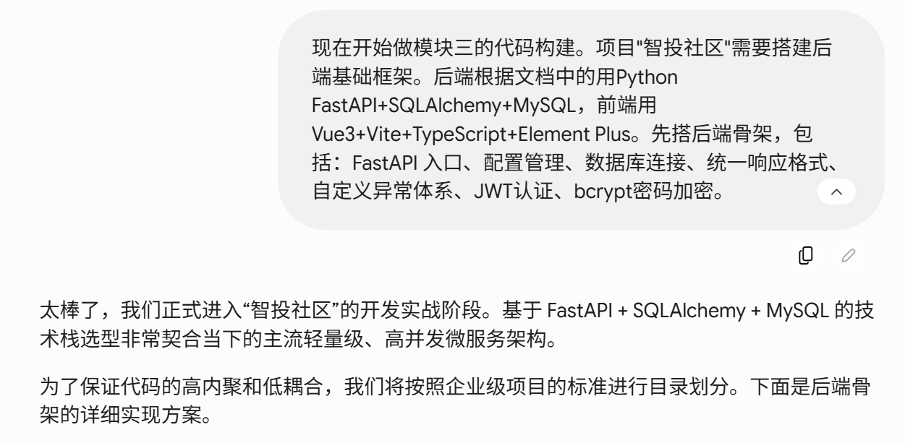
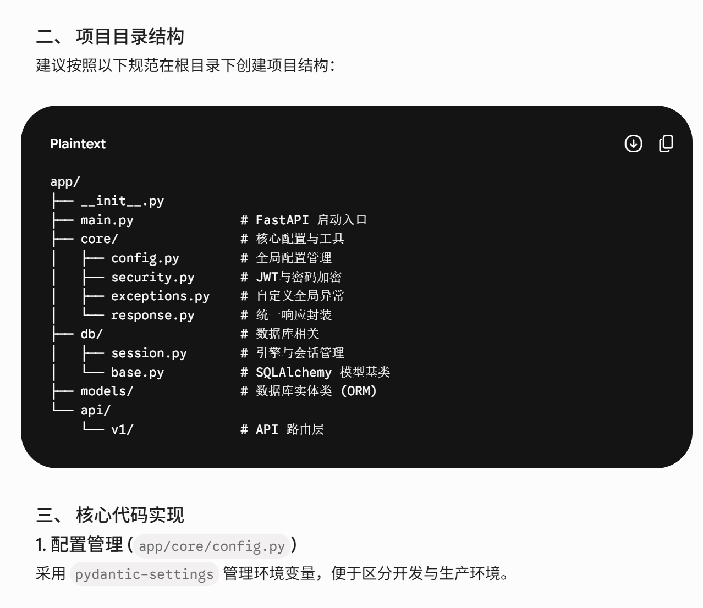
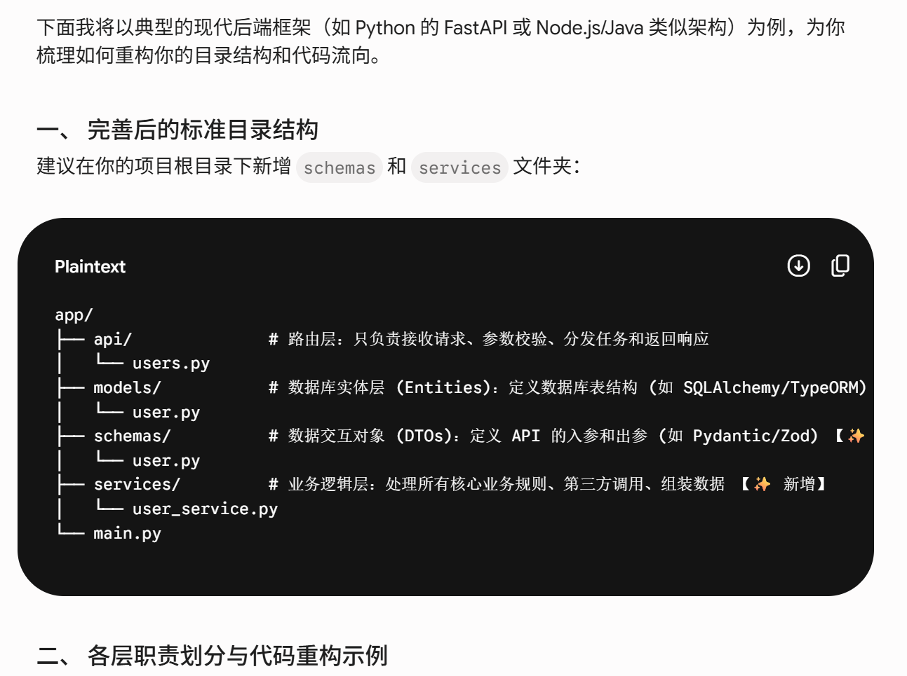
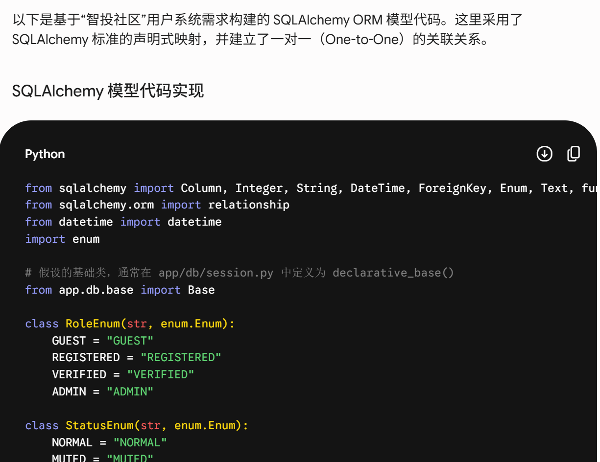
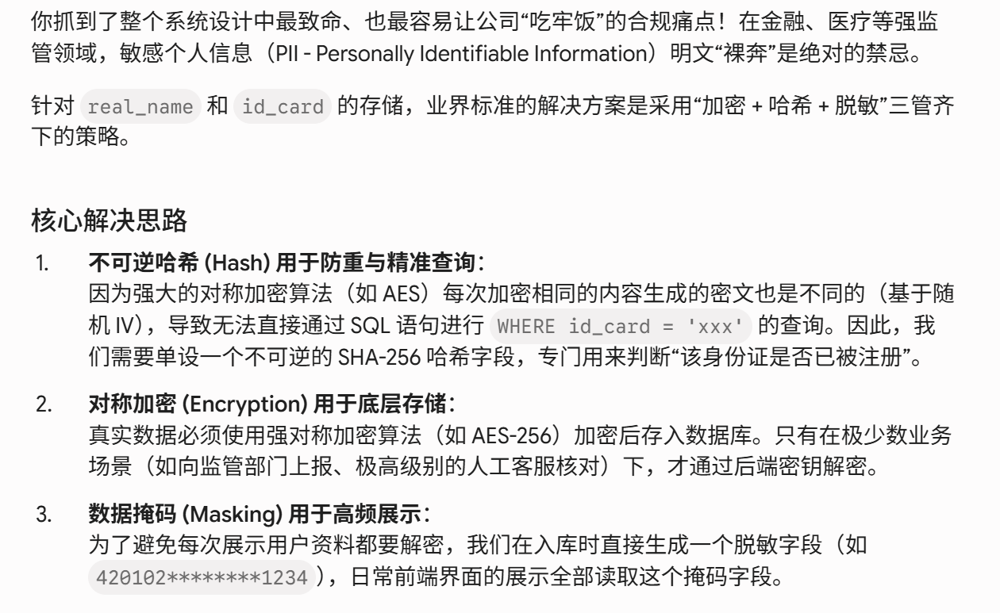
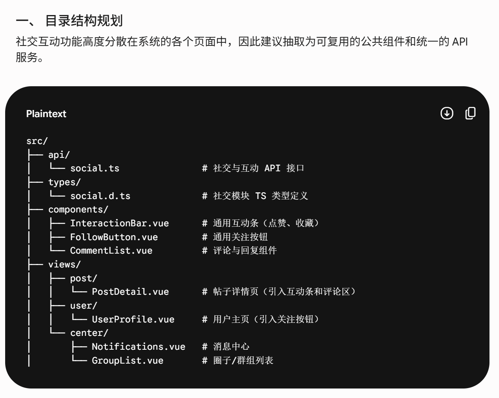
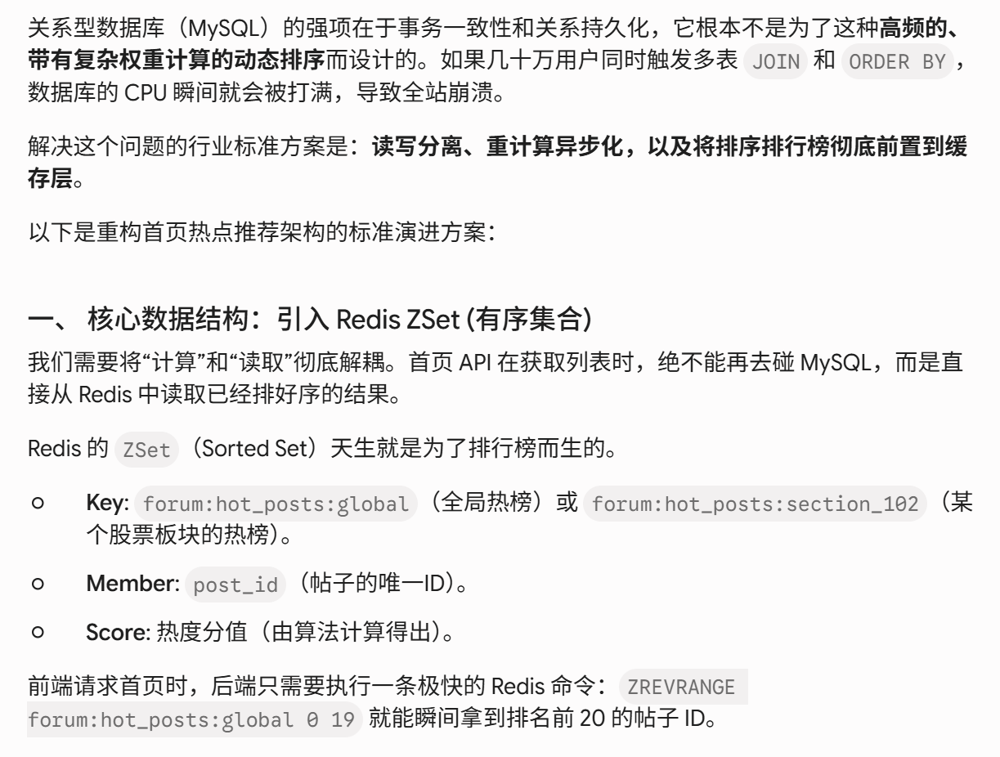
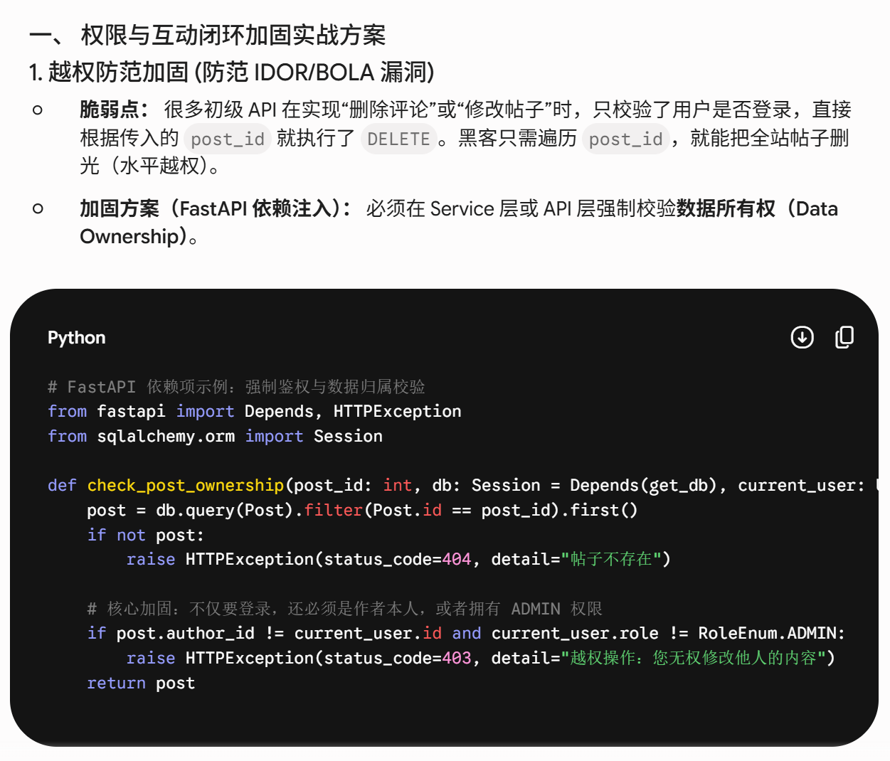
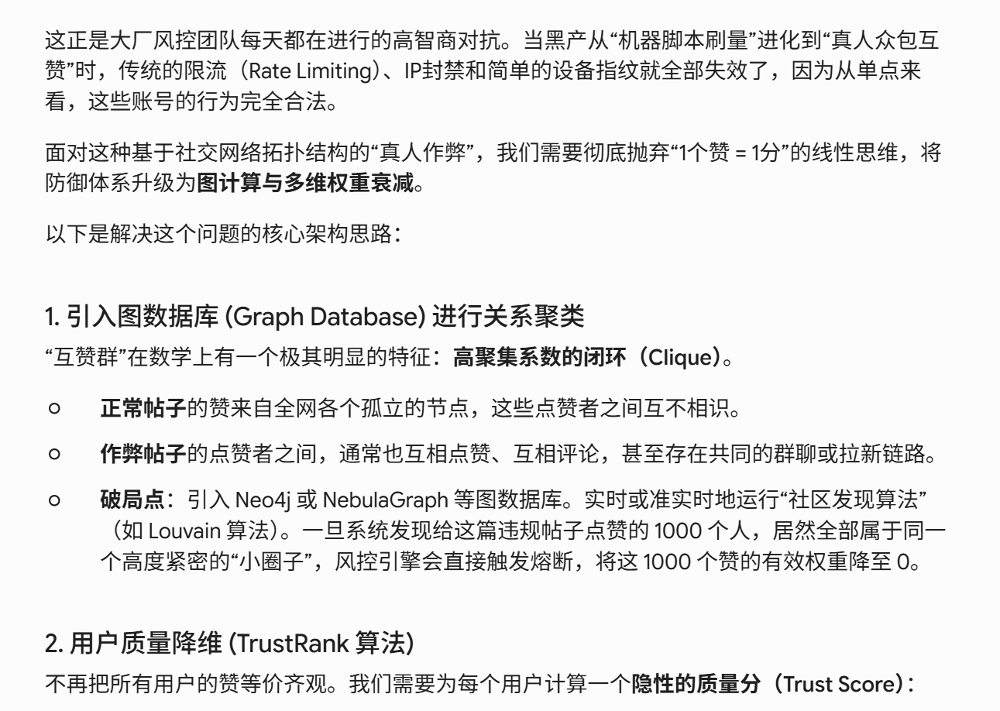

# AI 使用记录

## 模块三：AI辅助编码实现

### 一、项目框架搭建

#### 原始提示词

现在开始做模块三的代码构建。项目"智投社区"需要搭建后端基础框架。后端根据文档中的用Python FastAPI+SQLAlchemy+MySQL，前端用Vue3+Vite+TypeScript+Element Plus。先搭后端骨架，包括：FastAPI 入口、配置管理、数据库连接、统一响应格式、自定义异常体系、JWT认证、bcrypt密码加密。

#### AI输出摘要

AI生成了后端项目骨架原型，包括核心文件：
  

#### 人工检查

发现目录结构中只有数据库表实体和路由控制器，缺失了关键的业务逻辑层和数据交互对象。

#### 迭代优化
  

### 二、数据模型定义

#### 原始提示词

根据（模块2）db.md中的数据库设计，创建 SQLAlchemy 模型，用户系统需要 User、UserProfile 两个模型，对应 users 和 user_profiles表。
  
#### AI输出摘要

AI 生成了app/modules/auth/models.py，包含四个 SQLAlchemy 模型
  

#### 人工检查
real_name和 id_card直接作为 String 存放在 user_profiles 表中。金融类社区受极其严格的监管。一旦数据库被脱库或内部人员非法查询，用户的核心隐私将直接暴露，面临巨大的法律风险。

#### 迭代优化
  

### 三、社交互动模块实现

#### 原始提示词

根据模块二接口文档和 UI 设计，完成成员 C 社交互动模块。需要覆盖评论、回复、点赞、收藏、关注、通知、群组，并与帖子详情、用户主页、个人中心联动。
  

#### AI输出摘要

AI 新增了模型、请求结构、服务和路由：
  

#### 人工检查
社区首页通常需要展示“按点赞数、评论数、时间综合排序”的热点帖子。如果每次用户打开首页，后端都直接去MySQL执行复杂的 ORDER BY 和多表JOIN，遇到晚间高峰期，数据库会崩溃。

#### 迭代优化
利用读写分离、重计算异步化，以及将排序排行榜彻底前置到缓存层来解决问题。
  

### 四、权限与互动闭环加固

#### 原始提示词
目前系统已经跑通了核心的互动闭环（包含：发帖、点赞、评论、关注），但我需要你帮我进行“权限与互动闭环的深度加固”，以应对未来高并发和潜在的攻击。
  

#### AI输出摘要
  

#### 人工检查
我们的热度算法是基于点赞数 + 评论数。假如有人组织上千个真实账号（不是机器，是真人），互相给对方的违规荐股帖刷赞，瞬间把违规帖子顶上全站首页。

#### 迭代优化
将防御体系升级为图计算与多维权重衰减
  