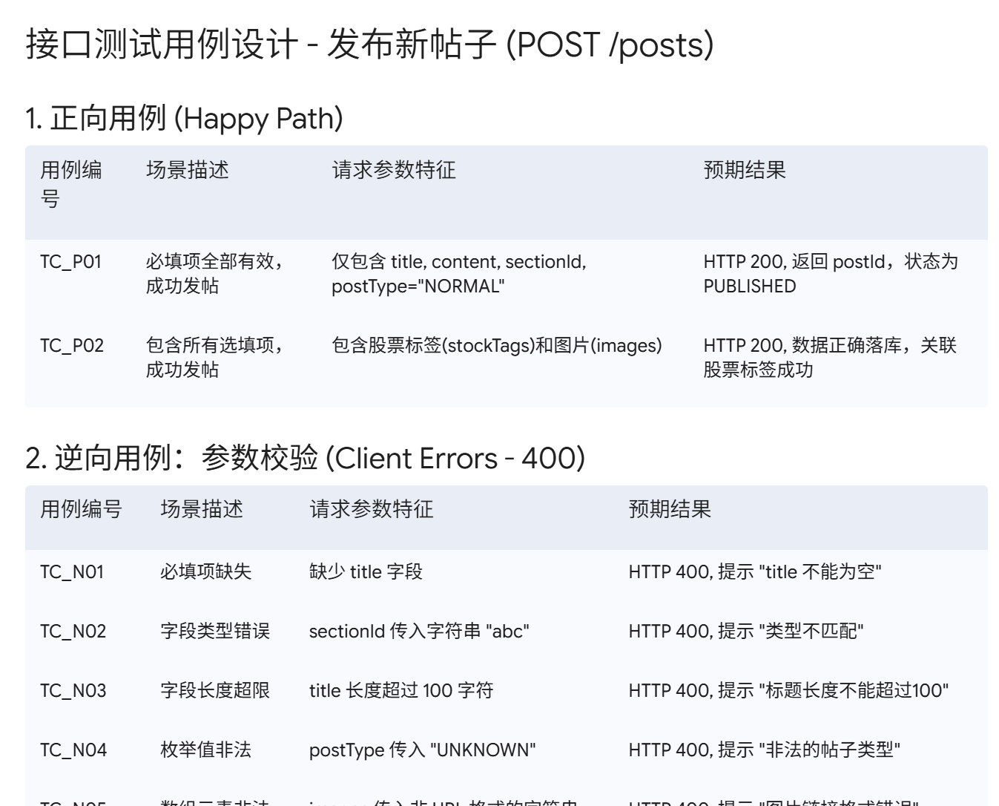
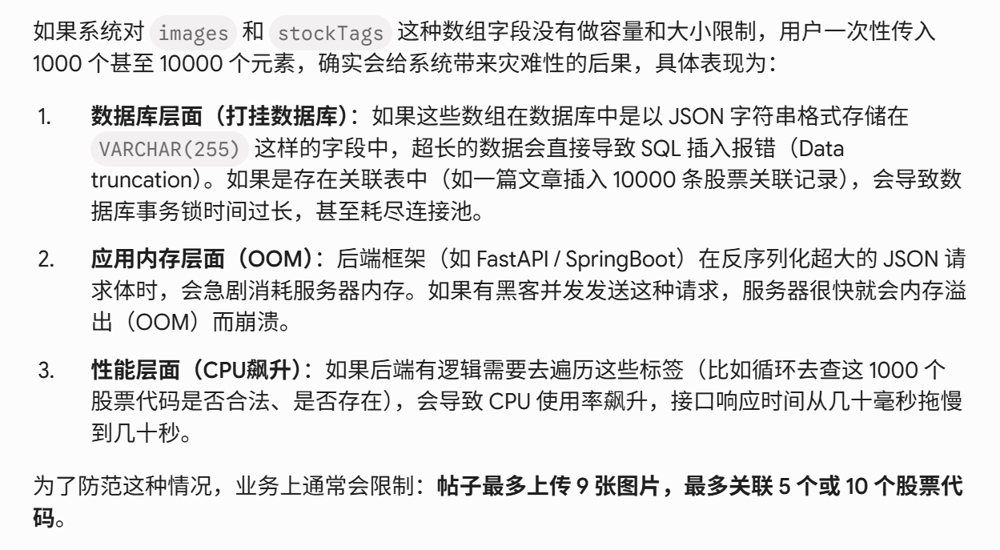
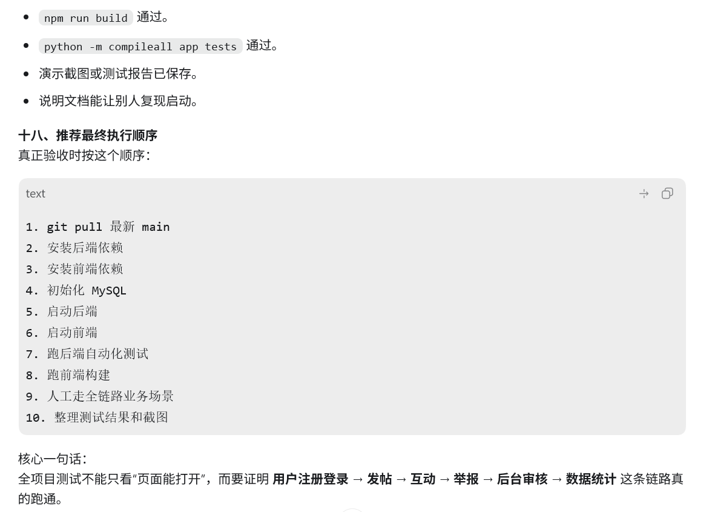
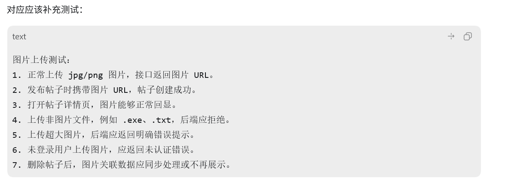
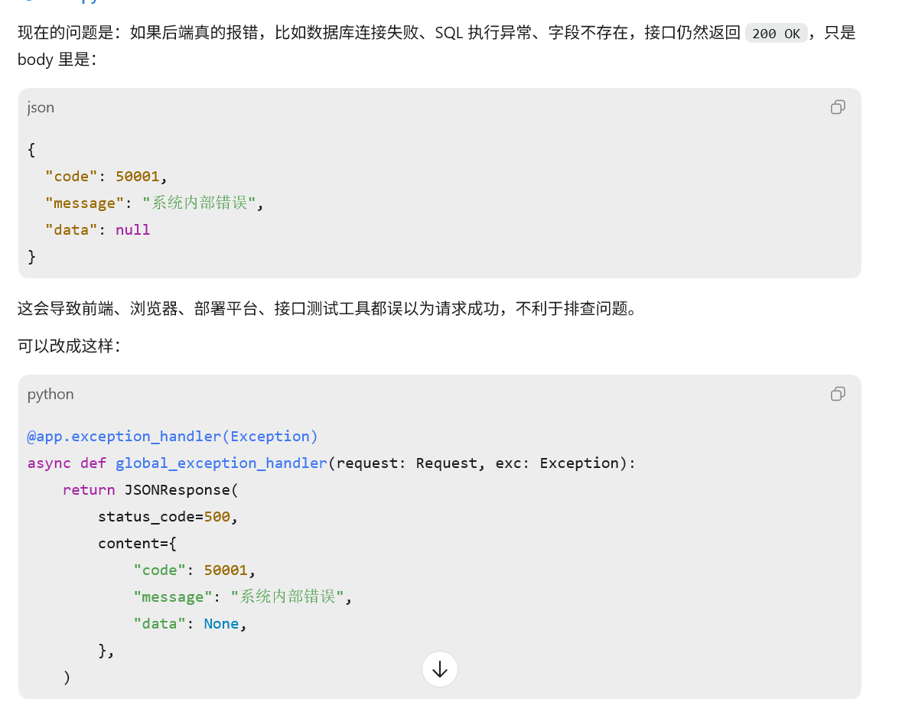
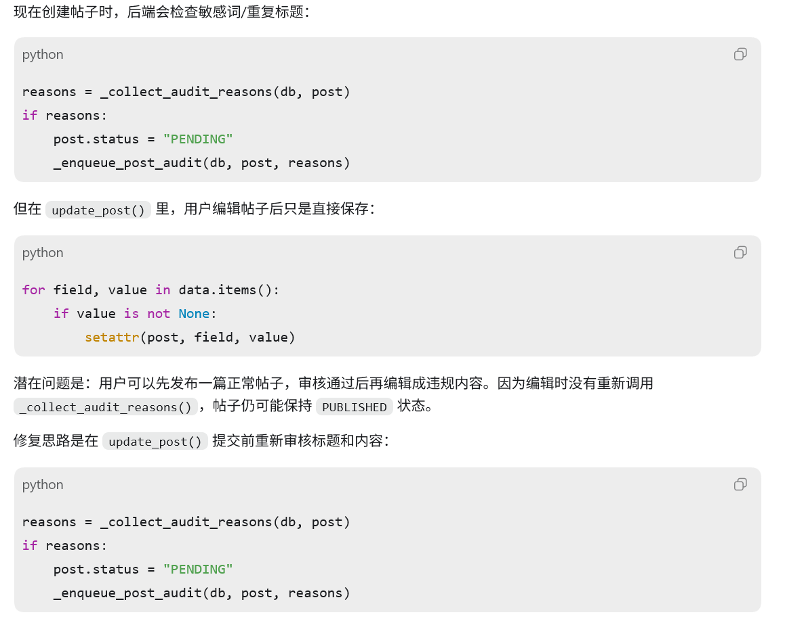

# AI 使用记录

## 模块四：AI辅助测试与调试

### 一、后端接口测试

#### 原始提示词

我目前正在开发一个后端接口，请基于我提供的接口信息，帮我设计一套全面、深度的接口测试用例，并输出对应的自动化测试脚本。

#### AI输出摘要
给出了几个测试用例

#### 人工检查
对于 images 和 stockTags 这两个数组，没有规定容量限制。如果用户一次性传入 1000 张图片或者 1000 个股票代码，会不会打挂接口或数据库

#### 迭代优化
为了防范这种情况，业务上通常会限制：帖子最多上传 9 张图片，最多关联 5 个或 10 个股票代码

### 二、功能构建测试

#### 原始提示词

请为我刚刚写入的新功能设计一套全链路的测试与构建验证方案。

#### AI输出摘要
ai给出了一套功能验证方案

#### 人工检查
发帖通常需要带图片，但整套方案完全没有提及图片上传接口的测试

#### 迭代优化
ai给出了图片上传接口测试的流程

### 三、ai辅助定位bug

#### 原始提示词
你现在是一位资深全栈架构师兼 Debug 专家，请仔细阅读我的代码，发现潜在的bug，同时给出修复后的完整可用代码片段

#### AI输出摘要
ai发现后端全局异常处理把所有服务器错误都返回成 HTTP 200

#### 人工检查
后端异常统一返回 HTTP 200不是 bug，是我们项目故意采用的统一响应格式设计，让ai不在修改，重新发现新的bug

#### 迭代优化
ai发现编辑帖子时不会重新触发审核逻辑
