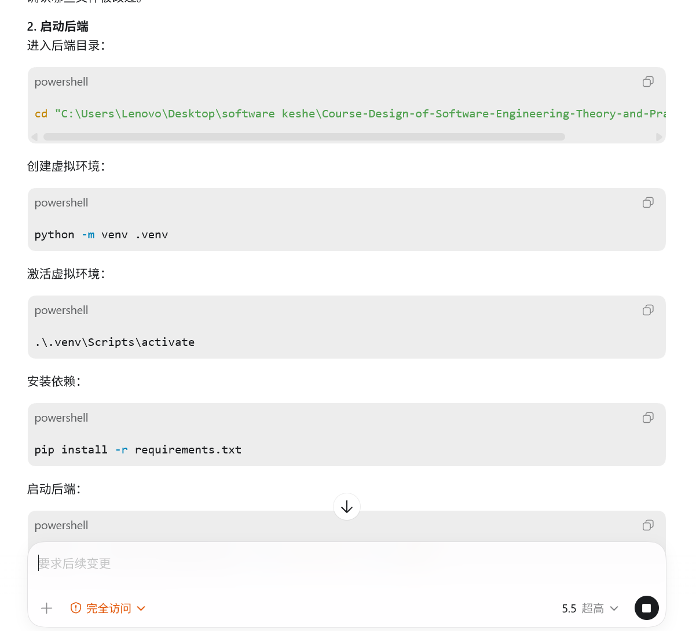
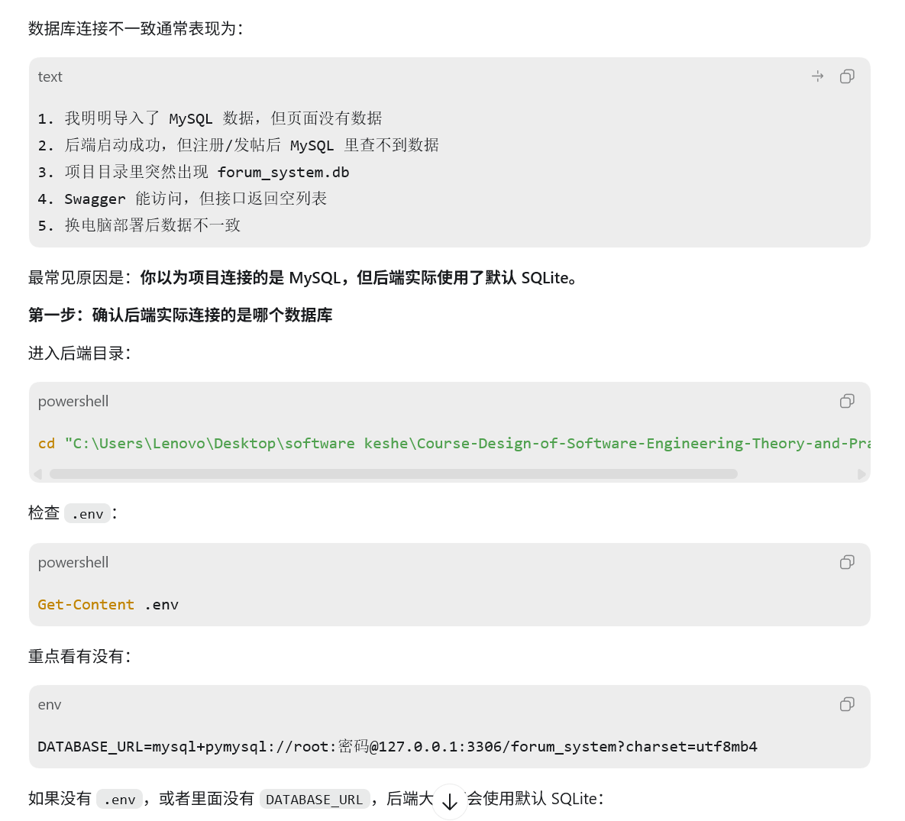
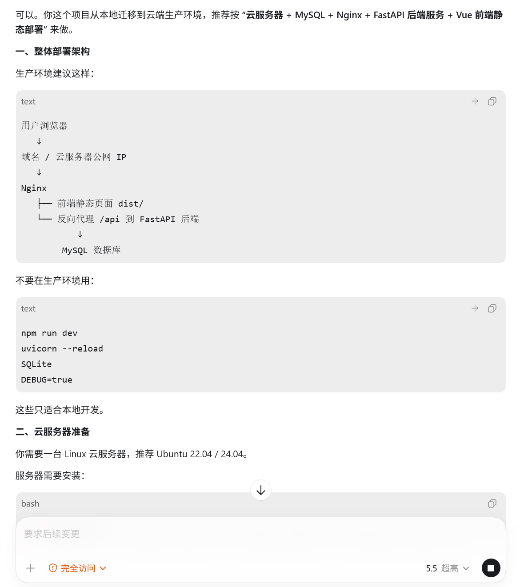
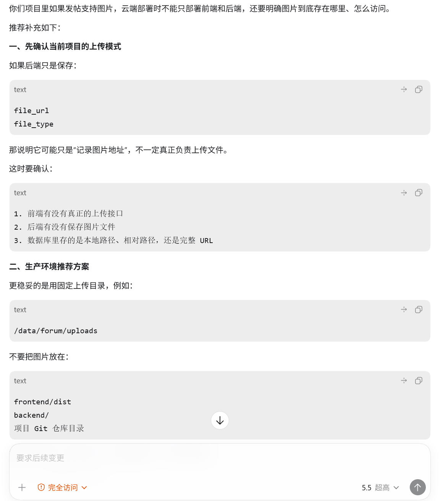

# AI 使用记录

## 模块五：本地部署与交付文档

### 一、本地部署

#### 原始提示词
你现在是一位资深的软件工程架构师，我现在需要将一个项目在本地计算机上进行完整部署，请告诉我该怎么做

#### AI输出摘要
ai给出了部署所需要的全流程

#### 人工检查
这个部署流程中缺少详细的备案，假如我数据库连接不一致该怎么办

#### 迭代优化
ai给出了详细的解决方案

### 二、云端部署

#### 原始提示词
我目前需要将项目从本地环境迁移到云端生产环境进行正式部署，请告诉我该怎么做

#### AI输出摘要
ai给出了详细的部署到云端服务器的步骤

#### 人工检查
这个流程中没有给出图片/附件上传的操作说明，否则本地能用，云端可能图片上传成功但无法显示

#### 迭代优化
ai补充了修改，详细解释了这个过程

